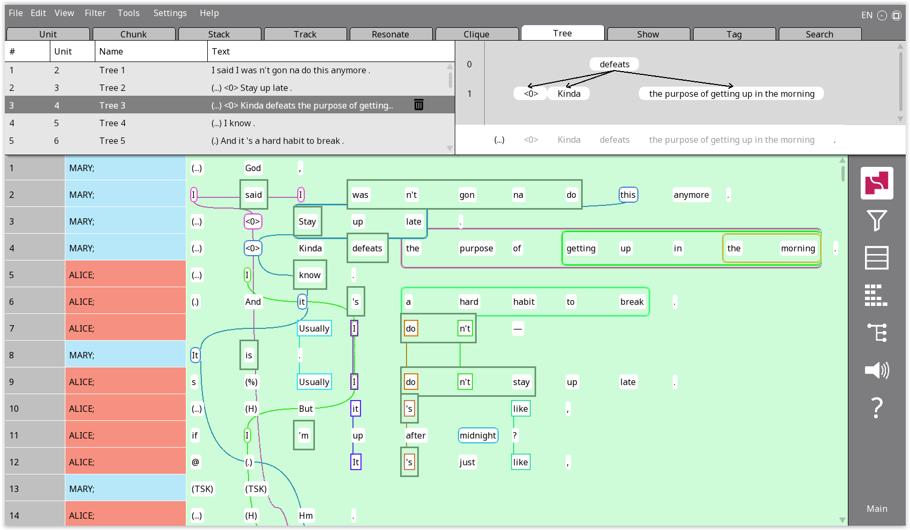
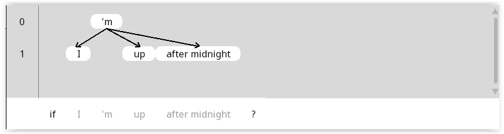

```{r, include = FALSE}
knitr::opts_chunk$set(
  collapse = TRUE,
  comment = "#>",
  warning = FALSE
)
options(rmarkdown.html_vignette.check_title = FALSE)
library(rezonateR)
```

Hello! If you're reading this tutorial, you're probably wondering how exactly RezonateR works, how to import data into RezonateR and how to understand how the data is then structured internally. If this desribes your situation, then this tutorial is for you!

You may or may not have read the introduction `vignette("overview")` that gives an overview to RezonateR, and it's fine either way - everything overed in that introduction that you'll need will be repeated here, in greater detail. The only exception is if you have not installed rezonateR at all - in that case, please do install it using the instructions from that tutorial first!

In this tutorial, we will:

1. Meet the .rez file that we need to import, along with a brief introduction on how Rezonator's internal JSON format, `.rez` files, are structured
2. Learn how to import files into `rezonateR`
3. Learn how to save and load `rezrObj` objects, the central data structure of `rezonateR`
4. Learn how the `nodeMap` inside a `rezrObj` is structured
5. Learn how the `rezrDF` inside a `rezrObj` is structured, and some basic functions for manipulating `rezrDF`s

## Meet our file!

To begin with, in this tutorial we will be using a simple Rezonator file. This file contains a minimal amount of annotation - just enough to explain the basic workings of RezonateR without being bogged down in long loading times that would result from a more extensively annotated files. The file is based on the text *A Tree's Life*, a conversation between two sisters from the Santa Barbara Corpus of Spoken American English. The first part of the file, which deals with the topic of one of the sisters' roommates, has been annotated for coreference (trails), resonance, as well as argument structure (through trees). There are also largely arbitrary stacks drawn throughout the file.

{width=100%}


### Node maps: The secret life of Rezonator files

The `.rez` files produced by Rezonator are visualised through the Rezonator interface, but they lead a secret double life! Internally, they are represented by a structure called a node map. All entities inside `.rez` files are represented as nodes, which store information in the form of text, numbers and pointers to other nodes.

To get an idea of what the node map looks like, let's load a `.rez` file. (You will never need to do this directly when working in `rezonateR`, as the import function will handle it for you; this is for demonstration purposes only.) We'll extract the node map from the `.rez` file after importing it into R, and then store it in the variable `rez007_nm`. The R package `rjson` converts the JSON format into a list format suitable for access using R code.

```{r}
library(rezonateR)
path = system.file("extdata", "sbc007.rez", package = "rezonateR", mustWork = T)

library(rjson)
getwd()
rez007_json = rjson::fromJSON(file = path)
rez007_nm = rez007_json[["ROOT"]][[1]][["nodeMap"]]
```

Let's zero on to a single node. The simplest type of node is a token, or a 'word' (this may be a morpheme or some other unit depending on the language and data you're working with.). Inside the Rezonator interface, tokens are the basic unit that you may interact with. Let's try the word *midnight*. The word *midnight* that you see on the screen has an ID of `28A862601A235`, and that's the key we access it from the node map by. Let's go ahead and examine some of the information embeddded inside the node:

```{r}
midnight = rez007_nm[["28A862601A235"]]
print(paste0("type: ", midnight$type))
print(paste0("docTokenSeq: ", midnight$docTokenSeq))
print(paste0("unit: ", midnight$unit))
print(paste0("place: ", midnight$place))
print(paste0("inEntryList: ", midnight$inEntryList))
print(paste0("inChainsList: ", midnight$inChainsList))
print(paste0("inChunkList: ", midnight$inChunkList))
#tagMap:
print(sapply(midnight$tagMap, c))
```
The `type` value indicates that we're looking at a token. `docTokenSeq` indicates the position of the word within the document. `unit` is a pointer to the node that contains the token's unit. `place` gives the position of the token within the unit.

The next three are lists of pointers to larger structures that may contain the token. (These 'lists' in `.rez` files are represented by vectors, not lists, in R.) `inEntryList`, `inChainsList` and `inChunkList` give the entries, chains and chunks in which 'midnight' are found. We will discuss entries in the next section. A chain can be a Track chain, i.e. trail, or a Rez chain, i.e. a resonance. In this case, 'midnight' was put in a trail, albeit one that contains only itself (i.e. it is a singleton), which is why you see a coloured box around the word, but no links emanating from it. So we do see a pointer to the track chain. It does not belong to any chunks, i.e. the larger rectangles typically consisting of multiple words.

The `tagMap` of a specific node includes the tags that were given when the raw file was first imported into Rezonator, as well as tags that were created by Rezonator or manually added in Rezonator. The tags in this specific example were all given during import; we will see examples of these later.

### Tokens and units
An entry is a leftover structure in Rezonator that currently serves no real purpose, except as the intermediate layer between units and tokens. As a general rule, entries correspond one-to-one with tokens. This is a technicality that you will occasionally need to know when working in RezonateR.

Basically, a unit only contains pointers to the entries that consists of it, in the attribute `entryList`. To look up individual tokens from a unit, then, you will have to go to individual entries' nodes to look up the corresponding token. For example, here is the `entryList` of the unit `2D1B3667B6110`:

```{r}
# entryList of unit 2D1B3667B6110:
print(rez007_nm[["2D1B3667B6110"]][["entryList"]])
```

To look up the first token in this unit, the word *if*, you need to look at the token value of the associated entry:

```{r}
#Token corresponding to entry 24796648BFF31:
rez007_nm[["24796648BFF31"]][["token"]]
```

Let's now verify that this token is indeed the word *if*:

```{r}
#Text of the token A27E39A69272:
rez007_nm[["A27E39A69272"]]$tagMap$text
```

### Chunks
Chunks are the large rectangular boxes that typically span more than one token. A chunk is automatically created whenever you add a track or rez entry that spans more than one token, but not when you add a single-token track or rez entry. So, for example, *midnight* was not put inside a chunk, but *the purpose of getting up in the morning* was put in a chunk the moment it became part of a track chain.

There are also chunks that do not belong to any chains, sometimes called *blank chunks*. In this document, blank chunks are used to mark verbal complexes in English, including verbs and auxiliaries, as well as any intervening adverbs. When a nominal intervenes between the auxiliary and the verb, the auxiliary is excluded from the verb chunk.

The word *Stay* on line 3 belongs to a blank chunk containing only *Stay*, and a chunk *Stay up late* in a track chain. Let's look at those two chunks. The ID for the token *Stay* is `1A0742C9033E5`:

```{r}
#Chunks that contain 1A0742C9033E5:
rez007_nm[["1A0742C9033E5"]]$inChunkList
```

So the two chunks that contain *Stay* are `35E3E0AB6803A` *Stay up late* and `15B9BB5D5086C` *Stay*. `35E3E0AB6803A` is the larger chunk that belongs to a chain (note that the individual token *Stay* `1A0742C9033E5` does *not* belong in the chain):

```{r} 
#Chains that contain 35E3E0AB6803A:
rez007_nm[["35E3E0AB6803A"]]$inChainsList
#Chains that contain 1A0742C9033E5:
rez007_nm[["1A0742C9033E5"]]$inChainsList
```

A manually added field in this file, `chunkType`, specifies the type of chunk that a certain chunk is. The field is blank for mentions in track chains, but filled for verbs:

```{r} 
#chunkType of 35E3E0AB6803A:
rez007_nm[["35E3E0AB6803A"]]$tagMap$chunkType
#chunkType of 15B9BB5D5086C:
rez007_nm[["15B9BB5D5086C"]]$tagMap$chunkType
```

This point will be important later on when we import, as it will be used to separate chunks into layers.

### Entries, links and chains
Rezonator currently has three data types that are termed 'chains'. Each of them have specific names for their entries. They are:

* A chain of track entities (i.e. mentions) is called a *trail* - i.e. a coreference chain containing mentions
* A chain of rez entities is a *resonances* - a rez entity is a specific instance of a word that is resonated somewhere else in the document, and a resonance is a collection of resonating tokens
* A chain of cards is a *stack*.

The first two types of entries correspond to words and chunks, and the third type of entries correspond to units.

Let's look at the track 1BF2260B4AB78, which corresponds to the chunk *Stay up late* 35E3E0AB6803A that we have seen before:

```{r}
rez007_nm[["1BF2260B4AB78"]]$chain
rez007_nm[["1BF2260B4AB78"]]$token
rez007_nm[["1BF2260B4AB78"]]$goalLinkList
```
*Stay up late* belongs to the chain, and corresponds to the 'token' (actually chunk - this is a quirk of the .rez format that will be important to remember when working in rezonateR) 35E3E0AB6803A. `goalLinkList` is a list of links that starts from this entry. Links live in a world of their own and are not particularly important for working in RezonateR, so we can safely ignore them for now.

To find out the member entries that a chain contains, you can look at its `setIDList`.

```{r}
rez007_nm[["2A01379C5D049"]]$setIDList
```

Entries and chains, like tokens (and units), have `tagMap`s, and these generally correspond to tags generated or manually added in Rezonator. Here's the `tagMap` of the track and trail we've seen. The track contains the tags `gapWords` (number of words from the previous track) and `gapUnits` (number of units from the previous track), as well as counts for the number of tokens and characters inside the track. The tag `chainSize` indicates the number of entries inside the chain. These are all automatically generated by Rezonator and will be covered in more detail when discussing coreference.

```{r}
sapply(rez007_nm[["1BF2260B4AB78"]]$tagMap, c)
sapply(rez007_nm[["2A01379C5D049"]]$tagMap, c)
```

### The tree map
Information related to trees reside in a sub-map of their own, separate from the other things we've been discussing so far. Here is an example of a tree from this file, containing the word 'midnight' we have discussed some time ago:

{width=100%}

There are three types of entities inside the tree map: `treeEntry`, `treeLink` and `tree`:

* A `tree` is, well, an individual tree.
* A `treeEntry` is a 'node' of a tree. It may contain one or multiple tokens - *after midnight* in our example, for example, contains two tokens, while the other two contain a single token. The one from which everything else branches out, in layer 0, is called the root.
* A `treeLink` is a link between two `treeEntry` entities

Unlike other links, `treeLink`s *are* important in working with rezonateR!

The ID for the tree you see in the image is `10F850E894052`. Let's first see which tokens and `treeEntry`s it consists of:

```{r}
rez007_nm$treeMap[["10F850E894052"]]$tokenList
rez007_nm$treeMap[["10F850E894052"]]$setIDList
```

**Note that the above lists include other parts of the IU that were not actually included in the tree (but which appear on the Rezonator interface for you to add); you will often have to exclude them from analysis.**

Now let's examine one of the entries more closely. `31630BD346EC7` is the ID of *after midnight*, and we can examine some of its attributes. The `sourceLink` attribute gives the ID of the link to *after midnight* link from *'m*, and `tokenList` gives the token IDs for the two tokens *after* and *midnight*:

```{r}
print(rez007_nm$treeMap[["31630BD346EC7"]]$sourceLink)
print(rez007_nm$treeMap[["31630BD346EC7"]]$tokenList)
```

And to wrap it up, how about looking at the link? We can look at its source (parent) and goal (child) `treeEntry` IDs, as well as its tag `Relation`, which I've annotated as `Subj`:

```{r}
print(rez007_nm$treeMap[["2CBAF1D3EE0C8"]]$source)
print(rez007_nm$treeMap[["2CBAF1D3EE0C8"]]$goal)
print(rez007_nm$treeMap[["2CBAF1D3EE0C8"]]$tagMap$Relation)
```

## Importing our file
Let's now actually import the file into `rezonateR`! Obviously our first step is to import the package:

```{r}
library(rezonateR)
```


The import function is `importRez()`. When importing, there are two important settings you will need to set. We will store the values of these settings in variables before importing. The first one is `layerRegex`:

```{r}
layerRegex = list(chunk = list(field = "chunkType",
                               regex = c("verb"),
                               names = c("verb", "refexpr")))
```

`layerRegex` allows you to separate chunks, tracks, rezes and trees as well as associated entities such as `trail`s and `treeEntry`s into layers. (At the moment, it is not technically possible for there to be stack layers, so this has not ye been implemented for stacks.) Each layer will receive a separate data frame.

In this file, we have two types of chunks: verbs and (largely) referential expressions. Verbs are annotated with the `chunkType` value 'verb', and referential expressions are unannotated. In order to tell this to `rezonateR`, we need to set pass a list to layerRegex. Permissible keys to this list include `chunk`, `track`, `rez`, `tree`; you can't use other keywords (such as 'trail').

Each of these entries is another list with three values: `field`, `regex` and `names`. The element `field` specifies the name of the field that will determine layer status (usually a dedicated field for determining the layer, which in this case is `chunkType`). The element `regex` specifies a list of regular expressions which, if matched in the field specified by `field`, will put an entity in a certain layer. The element `names` specifies the layer names; when it has one more item than the regex list (in this case the extra item is `"refexpr"`), then that layer is for items that do not match any of the regexes.

**If you do not assign layers to any of chunk, track, rez and tree, everything will be placed in a layer called `default`.** In our case, `track`, `rez` and `tree` (and their related entities, such as `treeEntry` or `resonance`) are all put in a layer called `default`. We will see how this works later on.

The other setting is `concatFields`:

```{r}
concatFields = c("text", "transcript")
```

When we are just looking at `nodeMap`s, we often feel lost because many nodes do not have any semblance of text on them. This is undesirable when we are doing analysis using data imported into `rezonateR`. In order to fix this, we can concatenate the text or transript fields of the tokens associated with each node, and this concatenated text will then be stored in the data frames that make up a `rezonateR` object. These fields must be specified as a vector passed to `concatFields`.

Here is the import function, using the settings from above. If you're following on in R, do note that this takes long to run! The tree-related steps should, in particular, take extra time to process.

```{r, cache=TRUE}
rez007 = importRez(path,
                   layerRegex = layerRegex,
                   concatFields = concatFields)
```

The variable `rez007` belongs to the class `rezrObj`. To save the imported `rezrObj` (something you will definitely want to do - nobody wants to import again!), use the function `rez_save()`. To load it again, use the function `rez_load()`. Both functions are quite easy: `rez_save()` simply requires a `rezrObj` and a save path, and `rez_load()` only a path to load from.

```{r}
savePath = "rez007.Rdata"
rez_save(rez007, savePath)
rez007 = rez_load(savePath)
```

A `rezrObj` consists of two components: a `nodeMap` and a bunch of `rezrDF`s. Let's look at the `nodeMap` object first.

### Meeting our nodeMap again
If you felt a bit lost when we were exploring `.rez` files before, here's some good news: `nodeMap`s in `rezonateR` are slightly easier to navigate than the node map in `.rez` files (phew)! The only major difference is that in `rezonateR` `nodeMap`s, every item type belongs to its own list. So the nodes in `rez007`'s `nodeMap` are organised into these categories:

```{r}
names(rez007$nodeMap)
```

### From nodeMap to rezrDF

The `rezrDF` is the soul of `rezonateR.` `rezrDF`s are similar to each individual entity list in the rezonateR `nodeMap`. However, instead of a list (dictionary) representation, `rezrDF`s are data frames, with each row being a node, and each column being its attributes.

There are a few ways in which columns are not identical to node attributes:

* The `id` column gives the ID of each node.
* `tagMap`s are 'flattened' (i.e. each tag its own column).
* Some attributes that are Rezonator-internal (e.g. focused on visualisation in Rezonator) and not useful for data analysis are discarded; you can always view them in the `nodeMap` if you really want to.
* List attributes are eliminated. (We will elaborate on this later.)

Each entity type in a `rezrObj` (token, track, trail, etc.) has a corresponding rezrDF or set of rezrDFs (`tokenDF`, `trackDF`, `trailDF`, etc.) that is directly accessed from the `rezrObj`. For example, to access the `rezrDF` corresponding to tokens, you would use `rez007$tokenDF`. Other than `nodeMap`, all the top-level entries of a rezrObj are `rezrDF`s:

```{r}
names(rez007)
```

Here is the beginning of the `tokenDF`. Notice the `id` column at the beginning, and the tags all getting their own columns:

```{r}
head(rez007$tokenDF)
```

For entity types with more than one layer, such as chunk or trail, there is a list of `rezrDF`s instead of a single `rezrDF`. For example, `rez007$chunkDF` contains two `rezrDF`s. Note that there is a column `layer` that contains the name of the layer, which will be identical across all rows in a `rezrDF`:

```{r}
head(rez007$chunkDF$refexpr)
head(rez007$chunkDF$verb)
```

Meanwhile, `rez007$trailDF` contains only one, `default`:

```{r}
head(rez007$trailDF$default)
```

When you have multiple layers, in many cases you will need to combine information from all layers to perform certain actions in `rezonateR.` There are functions to do this conveniently. `combineLayers()` combines all `rezrDF`s of a certain entity type. To use it, simply specify the `rezrObj` and the entity type as a string. There is an additional parameter, `type`, which may take the values `"intersect"` or `"union"`. This determines whether fields not present in all layers will be removed, or retained with `NA` values for rows in `rezrDF`s that don't have that column.

```{r}
head(combineLayers(rez007, "chunk", type = "intersect"))
#head(combineChunks(rez007, type = "intersect")) #Does the same thing
```

In the `nodeMap`, we often see lists of values, e.g. units contain a list of entries inside it. However, these lists are all eliminated from `rezrDF` representations. Notice the lack of entry lists in the `unitDF`:

```{r}
head(rez007$unitDF)
```

This is for simplicity's sake. Although it is technically possible to include these lists in data frames, it is clumsy and will likely slow down `rezonateR` a lot to do so. 

Of course, understandably sometimes we will still need to refer to each individual component of a larger entity. The function `getLowerFieldList()` is a way, if somewhat clumsy, of doing this. In this example, we extract the 'kinds' (Word, Pause, etc.) of the tokens of certain units:

```{r}
getLowerFieldList(rez007,
  fieldName = "kind",
  simpleDF = rez007$entryDF,
  complexDF = rez007$unitDF,
  complexNodeMap = rez007$nodeMap$unit,
  listName = "entryList",
  complexIDs = c("2AD10A854E6D3", "BDD7D839325A", "2752E3B395FC1")
)
```

The arguments to this function are:
* `fieldName` is the attribute we're extracting
* `simpleDF` is the `rezrDF` of the 'smaller' entity
* `complexDF` is the `rezrDF` of the 'larger' entity
* `complexNodeMap` is the nodeMap of the 'larger' entity
* `listName` is the name of the list inside each node of the `complexNodeMap` that gives the lower-level entries
* `complexIDs` gives the IDs of the 'larger' entities (in this case units) you want to extract values for. If left blank, this will be every single complex node (in this case every unit).

This is a very complicated function. One annoying use case is to get properties of tokens from track entries, so I provide the function `getTrackTokens()` to do this easily. For example, this code extracts the `kind` value of tracks:

```{r}
getTrackTokens(rez007, fieldName = "kind", trackDF = rez007$trackDF$default)[1:3]
```

In general, though, it is preferable to minimise this type of extraction. The coming tutorials will explain how we can do common operations without resorting to using `getLowerFieldList()`.

## Onwards!

Now that you know your way around `.rez` files and `rezrObj`s, you can go to the next tutorial to see how time is handled in Rezonator. If you're up for that,go to `vignette("time_seq.Rmd")`!
