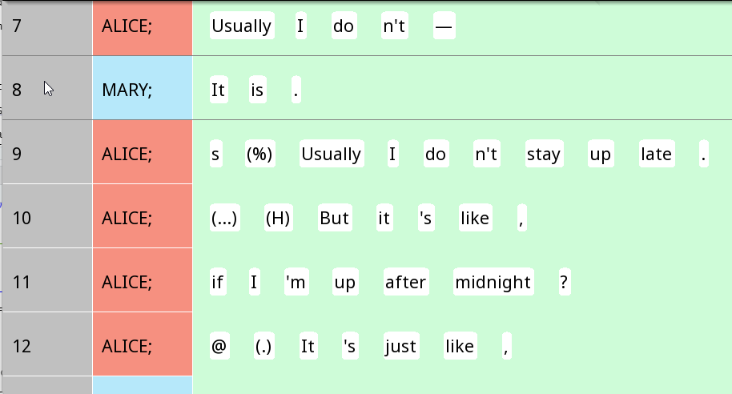
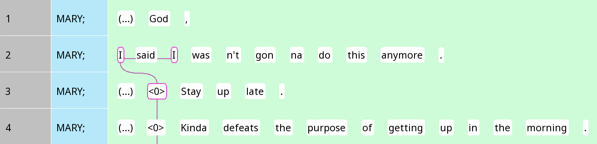
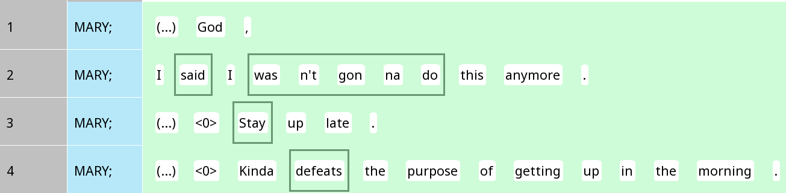
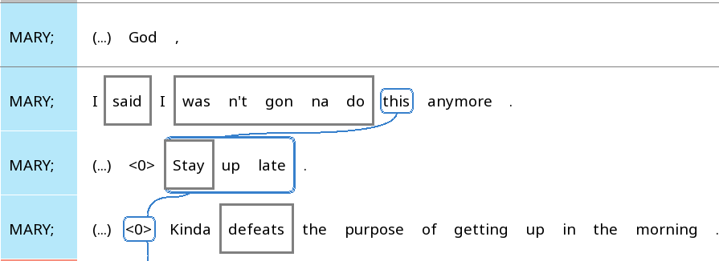
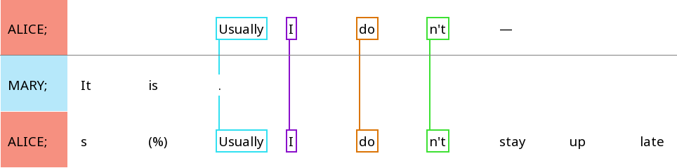

```{r, include = FALSE}
knitr::opts_chunk$set(
  collapse = TRUE,
  comment = "#>",
  warning = FALSE
)
options(rmarkdown.html_vignette.check_title = FALSE)
library(rezonateR)
```

Hello! If you're reading this tutorial, you're probably wondering how
exactly rezonateR works, how to import data into rezonateR and how to
understand how the data is then structured internally. If this describes
your situation, then this tutorial is for you!

If you are not yet familiar with what rezonateR does and want to see if
this is the right tool for you, here are some pages that will work
better for you:

+----------------------------------------------------------------------+
| -   If you are not very familiar with the                            |
|     [Rezonator](http://rezonator.com/) program that this package is  |
|     the companion tool of, I recommend going through the [toy exampl |
|                                                                      |
| e]                                                                   |
| (<https://rezonators.github.io/rezonateR/articles/sample_proj.html>) |
| `vignette("sample_proj")` first, which gives a concrete example of a |
| mini-research project in `rezonateR`.                                |
|                                                                      |
| -   If you are familiar with Rezonator but not yet with what         |
|     `rezonateR` does, the                                            |
|     [overview](h%2%20%20%20                                          |
| 0ttps://rezonators.%20github.io/rezonateR/articles/sample_proj.html) |
|     `vignette("overview")` gives a bird's-eye view of how            |
|     `rezonateR` can be useful for accompanying your Rezonator work.  |
|                                                                      |
|     None of the content in those tutorials is strictly prerequisites |
|     for this one, but they help motivate why `rezonateR` is useful   |
|     and help you decide whether `rezonateR` is a useful tool for you |
|     to learn. This tutorial gets into the nitty gritty of how to     |
|     code with `rezonateR`, rather than discussing the big picture.   |
+----------------------------------------------------------------------+

In this tutorial, you will learn about:

1.  The structure of Rezonator (`.rez`) files, including a brief
    introduction to the structure of Rezonator's internal JSON format
2.  How to import your Rezonator files into `rezonateR`
3.  How to save and load your data as `rezrObj` objects, the central
    data structure of `rezonateR`
4.  Learn how the linguistic data is structured as a `nodeMap` inside a
    `rezrObj`
5.  Learn how the data.frame `rezrDF` inside a `rezrObj` is structured,
    and some basic functions for manipulating these data frames
    (`rezrDF`s)

## Rezonator file structure

Before we start talking about the details of importing, saving and
loading in `rezonateR`, we need to familiarise ourselves with how
Rezonator data is formatted first. In this section, we will:

-   Learn the different elements of a Rezonator file (such as tracks,
    trails, chunks and trees)

-   Install and import `rezonateR`

-   Learn, on a high level, how these elements are represented in *node
    maps*, the format behind `.rez` files

### Elements in a Rezonator file

To discuss the different elements of a Rezonator file, in this tutorial
we will be using a simple Rezonator file. This file contains a minimal
amount of annotation - just enough to explain the basic workings of
`rezonateR` without being bogged down in long loading times that would
result from a more extensively annotated files.

The data used in this example is from the text *A Tree's Life* (SBC007),
a conversation between two sisters from the Santa Barbara Corpus of
Spoken American English. The first 162 lines have been annotated and
will be used in this tutorial; they deal with the topic of one of the
sisters' roommates. (The data is also available through the `sbc007`
object in the package itself, where a detailed description of the
annotations included may be found.)

Figure 1 shows an excerpt close to the beginning of the conversation in
Rezonator:

{width="77%"}

In this file, each line is referred to as a *unit*, which in this
context is an intonation unit (though lines may be sentences, clauses or
other larger structures in other contexts.) Each unit consists of a
series of tokens ('words') separate by spaces.

#### Tracks and trails

The file has been annotated for coreference chains, or *trails*. A trail
consists of several mentions or referential expressions that refer to
the same entity, each of which is individual called a *track*. They are
connected by wavy lines in Rezonator. Here is one example:

{width="100%"}

Here, the *Tim* and the two *he*s refer to the same person.

#### Zeroes

When there is a clause with an implicit participant that is not overtly
expressed in the linguistic form, the symbol \<0\> is used to indicate
the absence of such a form, and also included in a trail. Here is an
example:

{width="100%"}

Notice that the two occurrences of *I* on Line 2 are linked together
with a purple link, along with the zero on line 3.

#### Chunks

A 'chunk' in a Rezonator is a sequence of tokens within a unit, often a
type of phrase such as a noun phrase. There are two types of chunks
(elements represented by rectangles) in this file: Chunks that have been
created as tracks which form part of a trail (mostly referential
expressions), and verbal complexes, which are 'blank chunks', i.e. do
not belong to any trail and appear with grey borders. The following
figure shows some examples of these verbal chunks:

{width="100%"}

In this example, auxiliaries, negation and similar elements are placed
inside these verbal complexes, as one can see from *wasn't gonna do*.

Chunks have been annotated for two properties inside Rezonator.
`chunkType` is `verb` for verbs and left blank for referential
expressions, allowing us to distinguish between the two when importing
into rezonateR later. `largerChunk` is the larger chunk to which a chunk
belongs, which will be discussed later. These are shown in Figure 5:

{width="100%"}

In this image, *said* is a verb and all the other chunks are referential
expressions.

#### Trees

In Rezonator, trees are structures used to indicate relationships
between words/chunks and other words/chunks. In ths file we're working
with, there are a number of two-layered trees that indicate argument
structure of each verb. The root of each tree is the verb, and the
arguments are the leaves. The following figure shows the argument
structure of Line 4, with *defeats* as the root with three children: a
zero subject, the object *the purpose of getting up in the morning*, and
the adverb *kinda*:

{width="100%"}

The links between different parts of a tree are also tagged with the
field Relation. In this file, tree links are annotated as Relation =
"Subject" when it indicates a subject-verb relation; otherwise Relation
is left blank.

### Installing `rezonateR`

In the sections below, you may benefit by following along with the code.
To do this, use the following code:

```{r, eval = FALSE}
install.packages("devtools")
library(devtools)
install_github("rezonators/rezonateR")
```

### Node maps: The secret life of Rezonator files

The `.rez` files produced by Rezonator are visualised through the
Rezonator interface, but they lead a secret double life! Internally,
they are represented by a structure called a node map. All entities
inside `.rez` files are represented as nodes, which store information in
the form of text, numbers and pointers to other nodes. In this section,
we will quickly explore the node map, which you usually don't need to
deal with directly inside `rezonateR`, but provides an important basis
to understand how `rezonateR` works.

To get an idea of what the node map looks like, let's load a `.rez`
file. (You will never need to do this directly when working in
`rezonateR`, as the import function will handle it for you; this is for
demonstration purposes only.) We'll extract the node map from the `.rez`
file after importing it into R, and then store it in the variable
`rez007_nm`. The R package `rjson` converts the JSON format into a list
format suitable for access using R code.

```{r}
library(rezonateR)
path = system.file("extdata", "sbc007.rez", package = "rezonateR", mustWork = T)

library(rjson)
getwd()
rez007_json = rjson::fromJSON(file = path)
rez007_nm = rez007_json[["ROOT"]][[1]][["nodeMap"]]
```

Let's zero on to a single node. The simplest type of node is a token, or
a 'word' (this may be a morpheme or some other unit depending on the
language and data you're working with.). Inside the Rezonator interface,
tokens are the basic unit that you may interact with. Let's try the word
*midnight*. The word *midnight* that you see on the screen has an ID of
`28A862601A235`, and that's the key we access it from the node map by.
Let's go ahead and examine some of the information embeddded inside the
node:

```{r}
midnight = rez007_nm[["28A862601A235"]]
print(paste0("type: ", midnight$type))
print(paste0("docTokenSeq: ", midnight$docTokenSeq))
print(paste0("unit: ", midnight$unit))
print(paste0("place: ", midnight$place))
print(paste0("inEntryList: ", midnight$inEntryList))
print(paste0("inChainsList: ", midnight$inChainsList))
print(paste0("inChunkList: ", midnight$inChunkList))
#tagMap:
print(sapply(midnight$tagMap, c))
```

The `type` value indicates that we're looking at a token. `docTokenSeq`
indicates the position of the word within the document. `unit` is a
pointer to the node that contains the token's unit. `place` gives the
position of the token within the unit.

The next three are lists of pointers to larger structures that may
contain the token. (These 'lists' in `.rez` files are represented by
vectors, not lists, in R.) `inEntryList`, `inChainsList` and
`inChunkList` give the entries, chains and chunks in which 'midnight'
are found. We will discuss entries in the next section. (If you are
using later versions of Rezonator, `inChainsList` will be replaced by
`inResonanceList` and `inTrailList`. (???)) A chain can be a Track
chain, i.e. trail, or a Rez chain, i.e. a resonance. In this case,
'midnight' was put in a trail, albeit one that contains only itself
(i.e. it is a singleton), which is why you see a coloured box around the
word, but no links emanating from it. So we do see a pointer to the
track chain. It does not belong to any chunks, i.e. the larger
rectangles typically consisting of multiple words.

The `tagMap` of a specific node includes the tags that were given when
the raw file was first imported into Rezonator, as well as tags that
were created by Rezonator or manually added in Rezonator. The tags in
this specific example were all given during import; we will see examples
of these later.

#### Tokens and units

An entry is the intermediate layer between units and tokens. As a
general rule, entries correspond one-to-one with tokens. This is a
technicality that you will occasionally need to know when working in
rezonateR.

Basically, a unit only contains pointers to the entries that consists of
it, in the attribute `entryList`. To look up individual tokens from a
unit, then, you will have to go to individual entries' nodes to look up
the corresponding token. For example, here is the `entryList` of the
unit `2D1B3667B6110`:

```{r}
# entryList of unit 2D1B3667B6110:
print(rez007_nm[["2D1B3667B6110"]][["entryList"]])
```

To look up the first token in this unit, the word *if*, you need to look
at the token value of the associated entry:

```{r}
#Token corresponding to entry 24796648BFF31:
rez007_nm[["24796648BFF31"]][["token"]]
```

Let's now verify that this token is indeed the word *if*:

```{r}
#Text of the token A27E39A69272:
rez007_nm[["A27E39A69272"]]$tagMap$text
```

#### Chunks

A 'chunk' in a Rezonator is a sequence of tokens within a unit, often a
type of phrase such as a noun phrase. A chunk is automatically created
whenever you add a track or rez entry that spans more than one token,
but not when you add a single-token track or rez entry. So, for example,
in the following figure: *midnight* was not put inside a chunk, but *the
purpose of getting up in the morning* was put in a chunk the moment it
became part of a track chain.

{width="576"}

There are also chunks that do not belong to any chains, sometimes called
*blank chunks*. In this document, blank chunks are used to mark verbal
complexes in English, including verbs and auxiliaries, as well as any
intervening adverbs, as you can see in the figure. When a nominal
intervenes between the auxiliary and the verb, the auxiliary is excluded
from the verb chunk.

The word *Stay* on line 3 belongs to a blank chunk containing only
*Stay*, and a chunk *Stay up late* in a track chain. Let's look at those
two chunks. The ID for the token *Stay* is `1A0742C9033E5`:

```{r}
#Chunks that contain 1A0742C9033E5:
rez007_nm[["1A0742C9033E5"]]$inChunkList
```

So the two chunks that contain *Stay* are `35E3E0AB6803A` *Stay up late*
and `15B9BB5D5086C` *Stay*. `35E3E0AB6803A` is the larger chunk that
belongs to a chain (note that the individual token *Stay*
`1A0742C9033E5` does *not* belong in the chain):

```{r}
#Chains that contain 35E3E0AB6803A:
rez007_nm[["35E3E0AB6803A"]]$inChainsList
#Chains that contain 1A0742C9033E5:
rez007_nm[["1A0742C9033E5"]]$inChainsList
```

A manually added field in this file, `chunkType`, specifies the type of
chunk that a certain chunk is. The field is blank for mentions in track
chains, but filled for verbs:

```{r}
#chunkType of 35E3E0AB6803A:
rez007_nm[["35E3E0AB6803A"]]$tagMap$chunkType
#chunkType of 15B9BB5D5086C:
rez007_nm[["15B9BB5D5086C"]]$tagMap$chunkType
```

This point will be important later on when we import, as it will be used
to separate chunks into layers.

#### Entries, links and chains

Rezonator currently has three data types that are termed 'chains'. Each
of them have specific names for their entries. They are:

-   A chain of track entities (i.e. mentions) is called a *trail* - i.e.
    a coreference chain containing mentions. For example, in the
    following screenshot contains a single trail, marked in blue, with
    three visible tracks: *this*, *stay up late*, and the \<0\>. Each
    track can be a token or chunk.

    {width="624"}

-   A chain of rez entities is a *resonance* - a rez entity is a
    specific instance of a word that is resonated somewhere else in the
    document, and a resonance is a collection of resonating tokens. The
    following screenshot has four resonances, each with two rezzes of
    the same word (*usually*, *I*, *do*, *n't*). In this figure, each
    rez consists of a single token, but other annotations might allow
    for rezzes as chunks as well.

    {width="632"}

-   A chain of cards is a *stack*. A card corresponds to a unit, and a
    stack is basically a collection of units that make up some larger
    structure, for example a group of units inside a prosodic sentence
    or a turn. The following screenshot shows four stacks (in red,
    purple, beige and green, respectively). The first two and last stack
    have only one card, but the third beige stack has two cards,
    corresponding to the two units *Her husband .* and *Gary Bighare ?*.

    {width="467"}

Let's look at the track 1BF2260B4AB78, which corresponds to the chunk
*Stay up late* 35E3E0AB6803A in Figure 8 above:

```{r}
rez007_nm[["1BF2260B4AB78"]]$chain
rez007_nm[["1BF2260B4AB78"]]$token
rez007_nm[["1BF2260B4AB78"]]$goalLinkList
```

*Stay up late* belongs to the chain, and corresponds to the 'token'
(actually chunk - this is a quirk of the .rez format that will be
important to remember when working in rezonateR) 35E3E0AB6803A.
`goalLinkList` is a list of links that starts from this entry. Links
live in a world of their own and are not particularly important for
working in rezonateR, so we can safely ignore them for now.

To find out the member entries that a chain contains, you can look at
its `setIDList`.

```{r}
rez007_nm[["2A01379C5D049"]]$setIDList
```

Entries and chains, like tokens (and units), have `tagMap`s, and these
generally correspond to tags generated or manually added in Rezonator.
Here's the `tagMap` of the track and trail we've seen. The track
contains the tags `gapWords` (number of words from the previous track)
and `gapUnits` (number of units from the previous track), as well as
counts for the number of tokens and characters inside the track. The tag
`chainSize` indicates the number of entries inside the chain. These are
all automatically generated by Rezonator and will be covered in more
detail when discussing coreference.

```{r}
sapply(rez007_nm[["1BF2260B4AB78"]]$tagMap, c)
sapply(rez007_nm[["2A01379C5D049"]]$tagMap, c)
```

#### The tree map

Information related to trees reside in a sub-map of their own, separate
from the other things we've been discussing so far. Here is an example
of a tree from this file, containing the word 'midnight' we have
discussed some time ago:

{width="100%"}

There are three types of entities inside the tree map: `treeEntry`,
`treeLink` and `tree`:

-   A `tree` is, well, an individual tree.
-   A `treeEntry` is a 'node' of a tree. It may contain one or multiple
    tokens - *after midnight* in our example, for example, contains two
    tokens, while the other two contain a single token, but each of them
    corresponds to only one `treeEntry`, i.e. node in the tree. The
    `treeEntry` from which everything else branches out, in layer 0, is
    called the root.
-   A `treeLink` is a link between two `treeEntry` entities

Unlike other links, `treeLink`s *are* important in working with
rezonateR!

The ID for the tree you see in the image is `10F850E894052`. Let's first
see which tokens and `treeEntry`s it consists of:

```{r}
rez007_nm$treeMap[["10F850E894052"]]$tokenList
rez007_nm$treeMap[["10F850E894052"]]$setIDList
```

**Note that the above lists include other parts of the IU that were not
actually included in the tree (but which appear on the Rezonator
interface for you to add); you will often have to exclude them from
analysis.**

Now let's examine one of the entries more closely. `31630BD346EC7` is
the ID of *after midnight*, and we can examine some of its attributes.
The `sourceLink` attribute gives the ID of the link to *after midnight*
link from *'m*, and `tokenList` gives the token IDs for the two tokens
*after* and *midnight*:

```{r}
print(rez007_nm$treeMap[["31630BD346EC7"]]$sourceLink)
print(rez007_nm$treeMap[["31630BD346EC7"]]$tokenList)
```

And to wrap it up, how about looking at the link? We can look at its
source (parent) and goal (child) `treeEntry` IDs, as well as its tag
`Relation`, which I've annotated as `Subj`:

```{r}
print(rez007_nm$treeMap[["2CBAF1D3EE0C8"]]$source)
print(rez007_nm$treeMap[["2CBAF1D3EE0C8"]]$goal)
print(rez007_nm$treeMap[["2CBAF1D3EE0C8"]]$tagMap$Relation)
```

## Importing Rezonator files and saving/loading rezonateR files

Now that we've studied the basic structure of a Rezonator file, it's
time to actually start using `rezonateR`. In this section of the
tutorial, we will:

-   Learn how to import a `.rez` file into R as a `rezrObj`

-   Save and load the `rezrObj` that we created

-   Look at how the node map is represented in `rezrObj`

-   Most importantly, look at how the different data frames
    corresponding to nodes, called `rezrDF`s, are structured

### Importing Rezonator files

Let's now actually import the file into `rezonateR`! Obviously our first
step is to import the package:

```{r}
library(rezonateR)
```

The import function is `importRez()`. When importing, there are two
important settings you will need to set. We will store the values of
these settings in variables before importing. The first one is
`layerRegex`:

```{r}
layerRegex = list(chunk = list(field = "chunkType",
                               regex = c("verb"),
                               names = c("verb", "refexpr")))
```

`layerRegex` allows you to separate chunks, tracks, rezes and trees as
well as associated entities such as `trail`s and `treeEntry`s into
layers. (At the moment, it is not technically possible for there to be
stack layers, so this has not ye been implemented for stacks.) Each
layer will receive a separate data frame.

In this file, we have two types of chunks: verbs and (largely)
referential expressions. Verbs are annotated with the `chunkType` value
'verb', and referential expressions are unannotated. In order to tell
this to `rezonateR`, we need to set pass a list to layerRegex.
Permissible keys to this list include `chunk`, `track`, `rez`, `tree`;
you can't use other keywords (such as 'trail').

Each of these entries is another list with three values: `field`,
`regex` and `names`. The element `field` specifies the name of the field
that will determine layer status (usually a dedicated field for
determining the layer, which in this case is `chunkType`). The element
`regex` specifies a list of regular expressions which, if matched in the
field specified by `field`, will put an entity in a certain layer. The
element `names` specifies the layer names; when it has one more item
than the regex list (in this case the extra item is `"refexpr"`), then
that layer is for items that do not match any of the regexes.

**If you do not assign layers to any of chunk, track, rez and tree,
everything will be placed in a layer called `default`.** In our case,
`track`, `rez` and `tree` (and their related entities, such as
`treeEntry` or `resonance`) are all put in a layer called `default`. We
will see how this works later on.

The other setting is `concatFields`:

```{r}
concatFields = c("text", "transcript")
```

When we are just looking at `nodeMap`s, we often feel lost because many
nodes do not have any semblance of text on them. This is undesirable
when we are doing analysis using data imported into `rezonateR`. In
order to fix this, we can concatenate the text or transript fields of
the tokens associated with each node, and this concatenated text will
then be stored in the data frames that make up a `rezonateR` object.
These fields must be specified as a vector passed to `concatFields`.

Here is the import function, using the settings from above. If you're
following on in R, do note that this takes long to run! The tree-related
steps should, in particular, take extra time to process.

```{r, cache=TRUE}
rez007 = importRez(path,
                   layerRegex = layerRegex,
                   concatFields = concatFields)
```

### Saving and loading rezonateR objects

The variable `rez007` belongs to the class `rezrObj`. To save the
imported `rezrObj` (something you will definitely want to do - nobody
wants to import again!), use the function `rez_save()`. To load it
again, use the function `rez_load()`. Both functions are quite easy:
`rez_save()` simply requires a `rezrObj` and a save path, and
`rez_load()` only a path to load from.

```{r}
savePath = "rez007.Rdata"
rez_save(rez007, savePath)
rez007 = rez_load(savePath)
```

A `rezrObj` consists of two components: a `nodeMap` and a bunch of
`rezrDF`s. Let's look at the `nodeMap` object first.

### Meeting our nodeMap again

If you felt a bit lost when we were exploring `.rez` files before,
here's some good news: `nodeMap`s in `rezonateR` are slightly easier to
navigate than the node map in `.rez` files (phew)! The only major
difference is that in `rezonateR` `nodeMap`s, every item type belongs to
its own list. So the nodes in `rez007`'s `nodeMap` are organised into
these categories:

```{r}
names(rez007$nodeMap)
```

### From nodeMap to rezrDF

The `rezrDF` is the soul of `rezonateR.` `rezrDF`s are similar to each
individual entity list in the rezonateR `nodeMap`. However, instead of a
list (dictionary) representation, `rezrDF`s are data frames, with each
row being a node, and each column being its attributes.

There are a few ways in which columns are not identical to node
attributes:

-   The `id` column gives the ID of each node.
-   `tagMap`s are 'flattened' (i.e. each tag its own column).
-   Some attributes that are Rezonator-internal (e.g. focused on
    visualisation in Rezonator) and not useful for data analysis are
    discarded; you can always view them in the `nodeMap` if you really
    want to.
-   List attributes are eliminated. (We will elaborate on this later.)

Each entity type in a `rezrObj` (token, track, trail, etc.) has a
corresponding rezrDF or set of rezrDFs (`tokenDF`, `trackDF`, `trailDF`,
etc.) that is directly accessed from the `rezrObj`. For example, to
access the `rezrDF` corresponding to tokens, you would use
`rez007$tokenDF`. Other than `nodeMap`, all the top-level entries of a
rezrObj are `rezrDF`s:

```{r}
names(rez007)
```

Here is the beginning of the `tokenDF`. Notice the `id` column at the
beginning, and the tags all getting their own columns:

```{r}
head(rez007$tokenDF)
```

#### Layers of rezDFs

For entity types with more than one layer, such as chunk or trail, there
is a list of `rezrDF`s instead of a single `rezrDF`. For example,
`rez007$chunkDF` contains two `rezrDF`s. Note that there is a column
`layer` that contains the name of the layer, which will be identical
across all rows in a `rezrDF`:

```{r}
head(rez007$chunkDF$refexpr)
head(rez007$chunkDF$verb)
```

Meanwhile, `rez007$trailDF` contains only one, `default`:

```{r}
head(rez007$trailDF$default)
```

When you have multiple layers, in many cases you will need to combine
information from all layers to perform certain actions in `rezonateR.`
There are functions to do this conveniently. `combineLayers()` combines
all `rezrDF`s of a certain entity type. To use it, simply specify the
`rezrObj` and the entity type as a string. There is an additional
parameter, `type`, which may take the values `"intersect"` or `"union"`.
This determines whether fields not present in all layers will be
removed, or retained with `NA` values for rows in `rezrDF`s that don't
have that column.

```{r}
head(combineLayers(rez007, "chunk", type = "intersect"))
#head(combineChunks(rez007, type = "intersect")) #Does the same thing
```

#### Correspondence between higher-level and lower-level structures

In the `nodeMap`, we often see lists of values when a higher-level
structure consists of several elements of a lower structure, e.g. units
contain a list of entries inside it. However, these lists are all
eliminated from `rezrDF` representations. Notice the lack of entry lists
in the `unitDF`:

```{r}
head(rez007$unitDF)
```

This is for simplicity's sake. Although it is technically possible to
include these lists in data frames, it is clumsy and will likely slow
down `rezonateR` a lot to do so.

Of course, understandably sometimes we will still need to refer to each
individual component of a larger entity. The function
`getLowerFieldList()` is a way, if somewhat clumsy, of doing this. In
this example, we extract the 'kinds' (Word, Pause, etc.) of the tokens
of certain units:

```{r}
getLowerFieldList(rez007,
  fieldName = "kind",
  simpleDF = rez007$entryDF,
  complexDF = rez007$unitDF,
  complexNodeMap = rez007$nodeMap$unit,
  listName = "entryList",
  complexIDs = c("2AD10A854E6D3", "BDD7D839325A", "2752E3B395FC1")
)
```

The arguments to this function are:

-   `fieldName` is the attribute we're extracting

-   `simpleDF` is the `rezrDF` of the 'smaller' entity

-   `complexDF` is the `rezrDF` of the 'larger' entity

-   `complexNodeMap` is the nodeMap of the 'larger' entity

-   `listName` is the name of the list inside each node of the
    `complexNodeMap` that gives the lower-level entries

-   `complexIDs` gives the IDs of the 'larger' entities (in this case
    units) you want to extract values for. If left blank, this will be
    every single complex node (in this case every unit).

This is a very complicated function. One annoying use case is to get
properties of tokens from track entries, so I provide the function
`getTrackTokens()` to do this easily. For example, this code extracts
the `kind` value of tracks:

```{r}
getTrackTokens(rez007, fieldName = "kind", trackDF = rez007$trackDF$default)[1:3]
```

In general, though, it is preferable to minimise this type of
extraction. The coming tutorials will explain how we can do common
operations without resorting to using `getLowerFieldList()`; for
example, `addFieldForeign()` in `EasyEdit` (see the [EasyEdit
tutorial](https://rezonators.github.io/rezonateR/articles/edit_easyEdit.html)
at `vignette("edit_easyEdit")`) will allow you to add a field to the
table with the higher-level (e.g. structure that is created by getting a
single summary value of a field in a a lower-level structure), and
`rez_left_join()` in `TidyRez` allows you to perform similar operations
with a tidyverse syntax (see `vignette("edit_tidyRez")`.

## Onwards!

Now that you know your way around `.rez` files and `rezrObj`s, you can
go to the next tutorial to see how time is handled in Rezonator. If
you're up for that, go to the [tutorial on time and
sequence](https://rezonators.github.io/rezonateR/articles/time_seq.html)
(`vignette("time_seq")`)!
