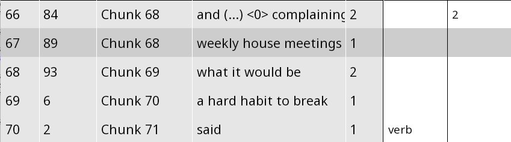

```{r, include = FALSE}
knitr::opts_chunk$set(
  collapse = TRUE,
  comment = "#>",
  warning = FALSE
)
options(rmarkdown.html_vignette.check_title = FALSE)
```


```{r, eval = FALSE}
install.packages("devtools")
library(devtools)
install_github("rezonators/rezonateR")
```


The aim of this article is to demonstrate, using a sample, highly simplified project, what type of analysis may be conducted using Rezonator and `rezonateR`. This particular example will examine the choice of referential forms in spoken dialogue: What factors lead to the choice of a longer form (e.g. *the three black cats*) versus a shorter one (e.g. *them*)? The data here is the same as that used in the series of tutorials starting with `vignette("import_save_basics")`, but this article will have less focus on how to write the code, and more on showing you how to answer the sample research question using `rezonateR`.

This article does not assume that you have read any of the other articles on `rezonateR`. So there is some overlap in the topics covered. I will point you to other tutorials for further details when necessary.

You are welcome to follow this tutorial in R. If you are reading this in R using the file `sample_proj.Rmd`, you can simply click on the 'run' button (green 'play' icon on the top right of each box). As long as all the code blocks are run sequentially, the code should work; otherwise, open a ticket on GitHub!

## The research question

It is often noted that in language, if a referent is more accessible (for example, it is salient in the previous discourse or physical context), we will tend to refer to it using a shorter and simpler form form, whereas longer forms tend to be used for things that are less accessible (for example, the first time we mention something). Thus, we should expect that in natural discourse, factors that render a referent more accessible are associated with shorter forms, and factors that make it less accessible are associated with longer forms.

This example will use the following factors to predict the length (in number of characters) of a certain referential expression:

* `noPrevSubjMentionsIn20`: The number of coreferent subject mentions within the 20 previous intonation units. That is, how many times was the referent of a form mentioned in the 20 previous intonation units in subject position?
* `noPrevNonSubjMentionsIn20`: The number of coreferent non-subject mentions within the 20 previous units. That is, how many times was the referent of a form mentioned in the 20 previous intonation units, outside of subject position?
* `noCompetitors`: The number of competitors within the five previous units. That is, how many times were entities other than the referent of the current referential expression mentioned within the five previous intonation units?
* `Relation`: Is the current referential expression a subject? 
* `number`: Is the current referential expression singular or plural?

Thus, our goal within R is to create a data frame where each row corresponds to a referential expresssion and contains all of these factors as columns (plus `charCount`, the number of characters).

## The data
The data used in this example is from the text *A Tree's Life*, a conversation between two sisters from the Santa Barbara Corpus of Spoken American English. The first 162 lines have been annotated here, which deals with the topic of one of the sisters' roommates.

The file has been annotated for coreference (trails), resonance, as well as argument structure (through trees). For this tutorial, resonance will be ignored. Coreference chains include referential expressions along with non-referring expressions that have been otherwise referred back to (e.g. discourse deixis). Figure 1 shows an example of the data in the Rezonator interface:

{width=100%}
(remove nav window, rez links?)

Wavy lines indicate coreference links. Each mention or referential expression is a *track* inside the larger trail. In this file,  entire clauses that serve as antecedents in cases of discourse deixis are also considered tracks. For example, notice that the two occurrences of *I* on Line 2 are linked together with a purple link, along with the zero on line 3. These expressions all form tracks that are part of the trail for Mary.


{width=100%}

Two-layered trees indicate argument structure of each verb. The verbal complex (including auxiliaries and adverbs that intervene between the auxiliary and verb, but not arguments that intervene between auxiliary and verb) is annotated as blank chunks (with chunkType = "verb") and serves as the root of each tree. Tree links are annotated as Relation = "Subject" when it indicates a subject-verb relation; otherwise Relation is left blank. For example, the tree panel of Figure 3 shows the argument structure of Line 4, with *defeats* as the root with three children: a zero subject, the object *the purpose of getting up in the morning*, and the adverb *kinda*;


{width=100%}


There are two types of chunks in this file: Chunks that have been created as part of a trail (mostly referential expressions - such as *the purpose of getting up in the morning* the example), and verbs, which are 'blank chunks', i.e. do not belong to any trail (such as *said* in the example). They have been annotated for two properties: `chunkType` (which is `verb` for verbs and left blank for referential expressions) and `largerChunk`, i.e. the larger chunk to which a chunk belongs. Note that `number` is NOT annotated; it will instead be annotated with the help of `rezonateR`.

[width=100%]

## Importing the file

The first step is to import the file. When importing a file, an object called `rezrObj` is created. `rezrObj` contains two kinds of elements:

* A `nodeMap`, which contains the data in the form of a series of interconnected nodes with attributes
* A series of `rezrDF`s, which are data frames containing information about different elements of the file.

Some important `rezrDF`s include: `tokenDF`, which contains the information about individual tokens of the original file, `chunkDF`, which contains information about chunks, `trackDF`, which contains information about entries of trails (i.e. mentions in coreference chains), and `treeEntryDF`, which contains information about entries on a tree.

Here's the import code. It contains two kinds of information: 
* How to divide the chunks into layers. Here, we divide the chunks into two layers, `verb` and `refexpr` (for referential expressions - this actually include some non-referential expressions which were put in track chains anyway, but we ignore this for this tutorial). Chunks in the two layers are put into two separate `rezrDF`s.
* Which fields of a token contains text to be concatenated in `concatFields`. The fields `text` and `transcript` of the Santa Barbara Corpus are concatenated to form `text` and `transcript` fields of larger structures like units and chunks. Telling this information to `rezonateR` is important for the text to appear in tables like `chunkDF` or `unitDF`.

```{r}
library(rezonateR)
path = system.file("extdata", "sbc007.rez", package = "rezonateR", mustWork = T)

layerRegex = list(chunk = list(field = "chunkType",
                               regex = c("verb"),
                               names = c("verb", "refexpr")))
concatFields = c("text", "transcript")
rez007 = importRez(path,
                   layerRegex = layerRegex,
                   concatFields = concatFields)
```

As examples of the content inside the imported object, here are the imported `chunkDF` members and `trackDF`:

```{r}
head(rez007$chunkDF)
head(rez007$trackDF$default) #Note: Because there is only one layer for `trackDF`, it is called 'default'.
```

More information about the import process and the various objects created can be found in `vignette("import_save_basics")`.

Each line of the table `rez007$trackDF$default` contains a referential expression whose size we want to predict. The goal of using `rezonateR` for this project will be to produce a version of the data frame `rez007$trackDF` that contains all the predictors and the dependent variable on each line, and may be fed to models such as `lm()`.

You can save the `rezrObj` with `rez_save()` so that it can be opened with `rez_load()` next time, saving you the trouble of importing again:

```{r}
savePath = "rez007.Rdata"
rez_save(rez007, savePath)
```


## Augmenting the file with basic information automatically

After importing the file, there are a few simple operations that we usually call to add additional information to the table which was not added during the original import process, before beginning the process of editing.

### Words vs tokens

By default Rezonator  provides two fields related to the position of a token, which you will see in `tokenDF` as columns:

* `docTokenSeq` - refers to the order of a token within the entire text
* `tokenOrder` -  refers to the position of a token within its intonation unit

Structures that span multiple tokens, like chunks and units, have four token sequence-related fields:

* `docTokenSeqFirst` - refers to the `docTokenSeq` of the first token.
* `docTokenSeqLast` - refers to the `docTokenSeq` of the last token.
* `tokenOrderFirst` - refers to the `tokenOrder` of the first token.
* `tokenOrderLast` - refers to the `tokenOrder` of the last token.

Here are some examples:

```{r}
head(rez007$tokenDF %>% select(id, text, tokenOrder, docTokenSeq))
head(rez007$chunkDF$refexpr %>% select(id, text, tokenOrderFirst, docTokenSeqFirst, tokenOrderLast, docTokenSeqLast))
```

Both orders count all tokens. In the Santa Barbara Corpus text we are using, this includes endnotes (such as `,` and `.`), transcriptions of vocalisms (such as `(H)` for in-breaths and `@@@` for laughter), and so on. What if we want a version of fields like `tokenOrder` and `docTokenSeq` that excludes these? We can use the function `addIsWordField()`:

```{r, cache = TRUE}
rez007 = addIsWordField(rez007, kind == "Word")
```

This adds the fields `wordOrder` and `docWordSeq` to `tokenDF` (and also its counterparts in places like `chunkDF` and `unitDF`, e.g. `wordOrderFirst`, `wordOrderLast`, `docWordSeqFirst`, `docWordSeqLast`). Here's an example in `tokenDF`:

```{r}
head(rez007$tokenDF %>% select(id, tokenOrder, docTokenSeq, wordOrder, docWordSeq))
```

### Unit sequence information

Information about the location of elements other than tokens inside units is not included by default. The function `addUnitSeq()` does this. Here, `unitSeqFirst` and `unitSeqLast` are added to `chunkDF` and `trackDF`:

```{r}
rez007 = addUnitSeq(rez007, "track")
head(rez007$chunkDF$refexpr %>% select(id, text, unitSeqFirst, unitSeqLast))
```

For the details of these functions, see `vignette("time_seq")`.

### Linking up non-tree tables with tree-related tables

Inside Rezonator, there are no direct links between trees and entities like tracks and chunks. The function `getAllTreeCorrespondences()` adds a column `treeEntry` to various tables, which gives the corresponding entry in the table `treeEntryDF`:

```{r}
rez007 = getAllTreeCorrespondences(rez007, entity = "track")
head(rez007$tokenDF %>% select(id, text, treeEntry))
head(rez007$chunkDF$refexpr %>% select(id, text, treeEntry))
head(rez007$trackDF$default %>% select(id, text, treeEntry))
```


### Combining chunks
In Rezonator, it is not possible to create chunks that span multiple units. `rezonateR` is equipped with the ability to combine several chunks inside the file into one larger chunk. There are two functions for doing this:

* `mergeChunksWithTree()`: If there is a treeEntry that corresponds to the concatenation of multiple chunks, then we merge those chunks.
* `mergeChunksWithIDs()`: We merge chunks by annotating the ID of the larger chunk that it belongs to, in this case in the field `largerChunk`. For example, the first chunk you create this way may have the ID 1, the second chunk 2, the third chunk 3 and so on. In this case, all the component chunks of the first complex chunk should have the value `1` for `largerChunk` and so on.

The new chunks will be added to the bottom of `chunkDF`. In addition, `chunkDF` will have an extra column `combinedChunk` giving information about chunk combinations:

```{r}
rez007 = mergeChunksWithTree(rez007)
rez007 = mergeChunksWithIDs(rez007, "largerChunk")
#Show combined referential expressions
rez007$chunkDF$refexpr %>%
  filter(combinedChunk != "") %>%
  select(id, text, combinedChunk) #Showing only combined chunks and their members
```

`mergedChunksToTrack()` puts this information in the `trackDF` too:

```{r}
rez007 = mergedChunksToTrack(rez007, "default")
#Show combined track members
rez007$trackDF$default %>%
  filter(combinedChunk != "") %>%
  select(id, name, text, combinedChunk) #Showing only combined chunks and their members
```

## Adding information about particular referential expressions
Recall that our final table will need to contain the following information:

* `charCount` (the dependent variable): The number of characters in a referential expression.
* `noPrevSubjMentionsIn20`: The number of coreferent subject mentions within the 20 previous units.
* `noPrevNonSubjMentionsIn20`: The number of coreferent non-subject mentions within the 20 previous units.
* `noCompetitors`: The number of competitors within the five previous units.
* `Relation`: Is the current mention a subject?
* `number`: Is the current mention singular or plural?

The first variable is already computed in Rezonator by default and need not be included again. The middle four will be added in later sections. This section will focus on the final variable.

We will first take a guess at what the number of a track in `rez007$trackDF` is using a set of simplistic rules based on the linguistic form. Then we export a `.csv` file from `rezonateR`, and edit the automatic guesses in Microsoft Excel. We then import the `.csv` file back into `rezonateR` and update `rez007$trackDF` from the imported file.

Let's say we want to annotate the number of the referential expressions inside `trackDF$default`. A good approximation will be to mark everything that ends with \<s\> as plural, along with common plural pronouns and demonstratives, mark coordinate noun phrases as plural, mark noun phrases with singular demonstratives as singular, mark *you* as uncertain, and then mark the rest as singular. Here we use the `rez_mutate()` function from TidyRez to do it (see `vignette("edit_tidyRez")` for more on these functions):

```{r}
rez007$trackDF$default = rez007$trackDF$default %>% rez_mutate(number = case_when(
  str_detect(text, " and ") ~ "pl",
  str_ends(text, "s") ~ "pl",
  str_detect(tolower(text), "(these|those)") ~ "pl",
  str_detect(tolower(text), "(this|that)") ~ "sg",
  tolower(text) %in% c("we", "they", "us", "them") ~ "pl",
  tolower(text) %in% c("you", "<0>") ~ "?",
  T ~ "sg"
))
head(rez007$trackDF$default %>% select(id, name, text, number))
```

Before we export this as a `.csv` for annotation, I would like to add a column inside the `trackDF` that gives us the transcription of the entire unit. It will be useful to be able to see this column while making manual annotations. To simplify, we will just get the last unit even for multi-line chunks. Here is the code. We are using `rez_left_join()`, another TidyRez function, and extracting the `text` column of the unit whose `unitSeq` in `unitDF` corresponds to the `unitSeqLast` of a referential expression in `trackDF`:

```{r}
rez007$trackDF$default = rez007$trackDF$default %>%
  rez_left_join(rez007$unitDF %>% rez_select(unitSeq, text),
                by = c(unitSeqLast = "unitSeq"),
                suffix = c("", "_unit"),
                df2key = "unitSeq",
                rezrObj = rez007,
                df2Address = "unitDF",
                fkey = "unitSeqLast") %>%
  rez_rename(unitLastText = text_unit)
```

We then write the `csv` file. We only export a subset of the columns in the `trackDF` so that our screen is cleaner and easier to work with:

```{r}
rez_write_csv(rez007$trackDF$default, "rez007_refexpr.csv", c("id", "unitLastText", "tokenOrderLast", "text", "name", "number"))
```

An editing best practice is to copy the `.csv` file and edit from the copy, rather from the `.csv` you export directly. Figure 2 shows what the exported `.csv` looks like in Excel:

{width=100%}

After editing the CSV in a spreadsheet program, we import it back using `rez_read_csv()` (specifying the original `rezrDF` makes the import processes smoother and less error-prone):

```{r}
changeDF = rez_read_csv("rez007_refexpr_edited.csv", origDF = rez007$trackDF$default)
```

Finally, we use the `updateFromDF()` function to change the `number` column:

```{r}
rez007$trackDF$default = rez007$trackDF$default %>%
  updateFromDF(changeDF, changeCols = "number")
head(rez007$trackDF$default %>% select(id, text, number))
```


## Adding information about argument structure
Now let's add the `Relation` variable. We use `addFieldForeign()`, which belongs to the EasyEdit family of functions covered in `vignette("edit_easyEdit")`. Recall that we've put a `treeEntry` column in `trackDF` that gives the ID of the corresponding tree entry. The following code looks into `treeEntryDF`, finds the `Relation` value corresponding to a `treeEntry`, and adds it to `trackDF`, allowing us to know whether each referential expression is a subject:

```{r}
rez007 = rez007 %>%
  addFieldForeign("track", "default", "treeEntry", "default", "treeEntry", "Relation", "Relation", fieldaccess = "foreign")
head(rez007$track$default %>% select(id, chain, text, treeEntry, Relation))
```


## Adding information about discourse context
Now we only have three predictors left to add:

* `noPrevSubjMentionsIn20`: The number of coreferent subject mentions within the 20 previous units.
* `noPrevNonSubjMentionsIn20`: The number of coreferent non-subject mentions within the 20 previous units.
* `noCompetitors`: The number of competitors within the five previous units.

We can add the first two using the function `countPrevMentionsIf()`, which counts the number of times that a referent was mentioned previously in a specified window of units, along with the TidyRez function `rez_mutate()` (note that for non-subjects, we allow `Relation` to be `NA`):

```{r}
rez007$trackDF$default = rez007$trackDF$default %>%
  rez_mutate(noPrevSubjMentionsIn20 = countPrevMentionsIf(20, Relation == "Subj"),
             noPrevNonSubjMentionsIn20 = countPrevMentionsIf(20, Relation != "Subj" | is.na(Relation)))
rez007$trackDF$default %>% select(id, noPrevSubjMentionsIn20, noPrevNonSubjMentionsIn20)  %>% slice(1:20)
```

The second one can be added using the function `countCompetitors()`:

```{r}
rez007$trackDF$default = rez007$trackDF$default %>%
  rez_mutate(noCompetitors = countCompetitors(windowSize = 5, between = F))
rez007$trackDF$default %>% select(id, noCompetitors)  %>% slice(1:20)
```

## Conducting the analysis

Let's check that `rez007$trackDF` now has all the required elements:

```{r}
rez007$trackDF$default %>% select(id, charCount, noPrevSubjMentionsIn20, noPrevNonSubjMentionsIn20, noCompetitors, Relation, number)  %>% slice(1:20)
```
Before analysis, let's change the NAs in the `Relation` column to `"NonSubj"` and change `Relation` and `number` to factors: 

```{r}
analysis_df = rez007$trackDF$default %>% 
  rez_mutate(Relation = coalesce(Relation, "NonSubj"), fieldaccess = "flex") %>%
  stringToFactor(c("Relation", "number"))
rez007$trackDF$default %>% select(id, Relation, number)  %>% slice(1:20)
```
And so we have our analysis:

```{r}
lm_nochar = lm(charCount ~ noPrevSubjMentionsIn20 + noPrevNonSubjMentionsIn20 + noCompetitors + Relation + number, data = analysis_df)
lm_nochar
anova(lm_nochar)
```
As we can see, `noPrevSubjMentionsIn20`, `noCompetitors` and `Relation` emerge as very good predictors, with entities mentioned more in the previous 20 units and which are subjects having a much stronger tendency to be short.

## Where to go from here?
This simple project shows most of the basic capabilities of `rezonateR`, though it still leaves out a lot, such as *reloads*, which allows you to update certain column automatically after changing other columns. `vignette("overview")` is a less topically focused overview of the package, less focused on a single problem but covering more topics. The series of tutorials starting from `vignette("import_save_basics")` covers most functionality of the package down to the smallest details, and you can pick and choose topics from there to read. Good luck!

