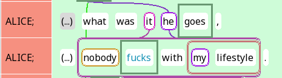
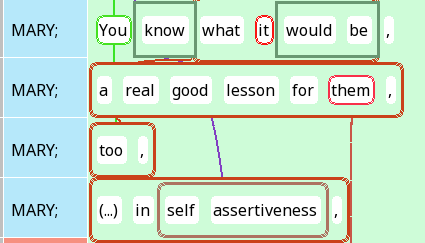
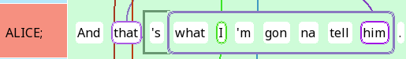

```{r, include = FALSE}
knitr::opts_chunk$set(
  collapse = TRUE,
  comment = "#>",
  warning = FALSE
)
options(rmarkdown.html_vignette.check_title = FALSE)
```


```{r, eval = FALSE}
install.packages("devtools")
library(devtools)
install_github("rezonators/rezonateR")
```


The aim of this article is to demonstrate, using a sample, highly simplified project, what type of analysis may be conducted using Rezonator and `rezonateR`. This particular example will examine the choice of referential forms in spoken dialogue: What factors lead to the choice of a longer form (e.g. *the three black cats*) versus a shorter one (e.g. *them*)? The data here is the same as that used in the series of tutorials starting with `vignette("import_save_basics")`, but this article will have less focus on how to write the code, and more on showing you how to answer the sample research question using `rezonateR`.

This article does not assume that you have read any of the other articles on `rezonateR`. So there is some overlap in the topics covered. I will point you to other tutorials for further details when necessary.

You are welcome to follow this tutorial in R. If you are reading this in R using the file `sample_proj.Rmd`, you can simply click on the 'run' button (green 'play' icon on the top right of each box). As long as all the code blocks are run sequentially, the code should work; otherwise, open a ticket on GitHub!

## The research question

It is often noted that in language, if a referent is more accessible (for example, it is salient in the previous discourse or physical context), we will tend to refer to it using a shorter and simpler form form, whereas longer forms tend to be used for things that are less accessible (for example, the first time we mention something). Thus, we should expect that in natural discourse, factors that render a referent more accessible are associated with shorter forms, and factors that make it less accessible are associated with longer forms.

This example will use the following factors to predict the length (in number of characters) of a certain referential expression:

* `noPrevSubjMentionsIn20`: The number of coreferent subject mentions within the 20 previous intonation units. That is, how many times was the referent of a form mentioned in the 20 previous intonation units in subject position?
* `noPrevNonSubjMentionsIn20`: The number of coreferent non-subject mentions within the 20 previous units. That is, how many times was the referent of a form mentioned in the 20 previous intonation units, outside of subject position?
* `noCompetitors`: The number of competitors within the five previous units. That is, how many times were entities other than the referent of the current referential expression mentioned within the five previous intonation units?
* `Relation`: Is the current referential expression a subject? 
* `number`: Is the current referential expression singular or plural?

Thus, our goal within R is to create a data frame where each row corresponds to a referential expresssion and contains all of these factors as columns (plus `charCount`, the number of characters).

## The data
The data used in this example is from the text *A Tree's Life*, a conversation between two sisters from the Santa Barbara Corpus of Spoken American English. The first 162 lines have been annotated here, which deals with the topic of one of the sisters' roommates.

The file has been annotated for coreference (trails), resonance, as well as argument structure (through trees). For this tutorial, resonance will be ignored. Coreference chains include referential expressions along with non-referring expressions that have been otherwise referred back to (e.g. discourse deixis). Figure 1 shows an example of the data in the Rezonator interface:

{width=100%}
(remove nav window, rez links?)

Wavy lines indicate coreference links. Each mention or referential expression is a *track* inside the larger trail. In this file,  entire clauses that serve as antecedents in cases of discourse deixis are also considered tracks. For example, notice that the two occurrences of *I* on Line 2 are linked together with a purple link, along with the zero on line 3. These expressions all form tracks that are part of the trail for Mary.


{width=100%}

Two-layered trees indicate argument structure of each verb. The verbal complex (including auxiliaries and adverbs that intervene between the auxiliary and verb, but not arguments that intervene between auxiliary and verb) is annotated as blank chunks (with chunkType = "verb") and serves as the root of each tree. Tree links are annotated as Relation = "Subject" when it indicates a subject-verb relation; otherwise Relation is left blank. For example, the tree panel of Figure 3 shows the argument structure of Line 4, with *defeats* as the root with three children: a zero subject, the object *the purpose of getting up in the morning*, and the adverb *kinda*:

{width=100%}


There are two types of chunks in this file: Chunks that have been created as part of a trail (mostly referential expressions - such as *the purpose of getting up in the morning* the example), and verbs, which are 'blank chunks', i.e. do not belong to any trail (such as *said* in the example). They have been annotated for two properties: `chunkType` (which is `verb` for verbs and left blank for referential expressions) and `largerChunk`, i.e. the larger chunk to which a chunk belongs. Note that `number` is NOT annotated; it will instead be annotated with the help of `rezonateR`.

[width=100%]

## Importing the file

The first step is to import the file. When importing a file, an object called `rezrObj` is created. `rezrObj` contains two kinds of elements:

* A `nodeMap`, which contains the data in the form of a series of interconnected nodes with attributes
* A series of `rezrDF`s, which are data frames containing information about different elements of the file.

Some important `rezrDF`s include: `tokenDF`, which contains the information about individual tokens of the original file, `chunkDF`, which contains information about chunks, `trackDF`, which contains information about entries of trails (i.e. mentions in coreference chains), and `treeEntryDF`, which contains information about entries on a tree.

Here's the import code. It contains two kinds of information: 
* How to divide the chunks into layers. Here, we divide the chunks into two layers, `verb` and `refexpr` (for referential expressions - this actually include some non-referential expressions which were put in track chains anyway, but we ignore this for this tutorial). Chunks in the two layers are put into two separate `rezrDF`s.
* Which fields of a token contains text to be concatenated in `concatFields`. The fields `text` and `transcript` of the Santa Barbara Corpus are concatenated to form `text` and `transcript` fields of larger structures like units and chunks. Telling this information to `rezonateR` is important for the text to appear in tables like `chunkDF` or `unitDF`.

```{r}
library(rezonateR)
path = system.file("extdata", "sbc007.rez", package = "rezonateR", mustWork = T)

layerRegex = list(chunk = list(field = "chunkType",
                               regex = c("verb"),
                               names = c("verb", "refexpr")))
concatFields = c("text", "transcript")
rez007 = importRez(path,
                   layerRegex = layerRegex,
                   concatFields = concatFields)
```

As examples of the content inside the imported object, here are the imported `chunkDF` members and `trackDF`:

```{r}
head(rez007$chunkDF)
head(rez007$trackDF$default) #Note: Because there is only one layer for `trackDF`, it is called 'default'.
```

More information about the import process and the various objects created can be found in `vignette("import_save_basics")`.

Each line of the table `rez007$trackDF$default` contains a referential expression whose size we want to predict. The goal of using `rezonateR` for this project will be to produce a version of the data frame `rez007$trackDF` that contains all the predictors and the dependent variable on each line, and may be fed to models such as `lm()`.

You can save the `rezrObj` with `rez_save()` so that it can be opened with `rez_load()` next time, saving you the trouble of importing again:

```{r}
savePath = "rez007.Rdata"
rez_save(rez007, savePath)
```


## Augmenting the file with basic information automatically

After importing the file, there are a few simple operations that we usually call to add additional information to the table which was not added during the original import process, before beginning the process of editing.

### Words vs tokens

By default Rezonator  provides two fields related to the position of a token, which you will see in `tokenDF` as columns:

* `docTokenSeq` - refers to the order of a token within the entire text
* `tokenOrder` -  refers to the position of a token within its intonation unit

Structures that span multiple tokens, like chunks and units, have four token sequence-related fields:

* `docTokenSeqFirst` - refers to the `docTokenSeq` of the first token.
* `docTokenSeqLast` - refers to the `docTokenSeq` of the last token.
* `tokenOrderFirst` - refers to the `tokenOrder` of the first token.
* `tokenOrderLast` - refers to the `tokenOrder` of the last token.

Here are some examples:

```{r}
head(rez007$tokenDF %>% select(id, text, tokenOrder, docTokenSeq))
head(rez007$chunkDF$refexpr %>% select(id, text, tokenOrderFirst, docTokenSeqFirst, tokenOrderLast, docTokenSeqLast))
```

Both orders count all tokens. In the Santa Barbara Corpus text we are using, this includes endnotes (such as `,` and `.`), transcriptions of vocalisms (such as `(H)` for in-breaths and `@@@` for laughter), and so on. What if we want a version of fields like `tokenOrder` and `docTokenSeq` that excludes these? We can use the function `addIsWordField()`:

```{r, cache = TRUE}
rez007 = addIsWordField(rez007, kind == "Word")
```

This adds the fields `wordOrder` and `docWordSeq` to `tokenDF` (and also its counterparts in places like `chunkDF` and `unitDF`, e.g. `wordOrderFirst`, `wordOrderLast`, `docWordSeqFirst`, `docWordSeqLast`). Here's an example in `tokenDF`:

```{r}
head(rez007$tokenDF %>% select(id, tokenOrder, docTokenSeq, wordOrder, docWordSeq))
```

### Unit sequence information

Information about the location of elements other than tokens inside units is not included by default. The function `addUnitSeq()` does this. Here, `unitSeqFirst` and `unitSeqLast` are added to `chunkDF` and `trackDF`:

```{r}
rez007 = addUnitSeq(rez007, "track")
head(rez007$chunkDF$refexpr %>% select(id, text, unitSeqFirst, unitSeqLast))
```

For the details of these functions, see `vignette("time_seq")`.

## Pass 1: Predicting length from lookback distance

### `gapUnits`: Lookback distance in R

As you may have noticed when using Rezonator, Rezonator automatically calculates the number of distances from each track (mention) to the previous mention in the same trail (coreference chain). This is called `gapUnits`, and it is automatically imported from Rezonator into rezonateR in `trackDF`. The `gapUnits` value is `N/A` for first mentions of things; otherwise it is a nonnegative integer.

Because first mentions are usually not accessible in discourse when they are first introduced, we can expect that they would be referred to using heavier noun phrases. Let's try to verify that this is the case. (This tutorial will use some Tidyverse functions, such as those from `ggplot2`; feel free to click on any functions that you do not recognise).

```{r}
library(ggplot2)
rez007$trackDF$default %>%
  mutate(isFirst = case_when(gapUnits == "N/A" ~ "First",
                             T ~ "NonFirst")) %>%
  ggplot(aes(x = isFirst, y = charCount)) + geom_violin()
```


Clearly, we can see that first mentions have a much higher tendency to be referred to using a noun phrase that has more characters.

Among the non-first mentions, can we also predict whether the character count from `gapUnits`? Let's again do a quick visualisation. If we exclude non-first mentions, and plot the relationship betwee `gapUnits` and `charCount`, this is what we get:

```{r}
rez007$trackDF$default %>%
  filter(gapUnits != "N/A", charCount > 0) %>%
  mutate(gapUnits = as.integer(gapUnits)) %>%
  ggplot(aes(x = gapUnits, y = charCount)) + geom_count()
```

Oh no, what's going on? It seems that `gapUnits` is not predicting what we would usually expect to see. Most of the long `gapUnits` noun phrases are fairly light, and there are quite a few small `gapUnits` phrases that are quite long.

In the rest of the tutorial, we will partially account for this weirdness. But for now, let's try to apply a simple linear model to this data to see what happens when we try to predict `charCount` from `gapUnits`. (Note: This is not the best model for the model specification we're looking at, but let's keep it simple for this tutorial.)

```{r}
pass1_model1 = rez007$trackDF$default %>%
  filter(gapUnits != "N/A", charCount > 0) %>%
  mutate(gapUnits = as.integer(gapUnits)) %>%
  lm(charCount ~ gapUnits, .)
summary(pass1_model1)
```
As we can see, although there is a negative coefficient that says a larger `gapUnits` leads to a smaller character count (as expected), it is not significant.

## A finer-grained distance metric?

There is another value, `gapWords`, that is automatically calculated in Rezonator and calculates the number of tokens from the current mention to the previous one. Would this finer-grained measure do better than `gapUnits`? Let's try:


```{r}
rez007$trackDF$default %>%
  filter(gapWords != "N/A", charCount > 0) %>%
  mutate(gapWords = as.integer(gapWords)) %>%
  ggplot(aes(x = gapWords, y = charCount)) + geom_count()
pass1_model2 = rez007$trackDF$default %>%
  filter(gapWords != "N/A", charCount > 0) %>%
  mutate(gapWords = as.integer(gapWords)) %>%
  lm(charCount ~ gapWords, .)
summary(pass1_model2)
```

The pattern is not much clearer from the diagram this time than last time, and there is little change with the linear model either: The p-value is still around 0.2.

There are ways we can potentially improve on these measures as well as other predictors of character count that we can potentially explore. We'll continue doing this throughout the tutorial.


## Pass 2: Getting started with EasyTrack 

Having attempted to predict character count from predictors imported directly from Rezonator, let's try to derive some predictors using `rezonateR` functions. This section will cover some basic functions in the `EasyTrack` series of functions. See `vignette("track")` for details about them./

### Counting previous mentions
The function `countPrevMentions()` in `rezonateR` is one function we can use. In its simplest form, you can simply specify a window of units in which to look. We will look at the 10 previous units. We will add this value to the `trackDF` using the `rez_mutate()` function, which is part of the TidyRez family (`vignette("edit_tidyRez")`), in order to ensure that the resulting data frame will remain in the correct `rezonateR` format.

```{r}
rez007$trackDF$default = rez007$trackDF$default %>%
  rez_mutate(noPrevMentionsIn10 = countPrevMentions(10))
rez007$trackDF$default %>% select(id, noPrevMentionsIn10)  %>% slice(1:20)
```
Now let's try to draw a scatterplot and fit a linear model, as we have done before:

```{r}
rez007$trackDF$default %>%
  filter(gapWords != "N/A", charCount > 0) %>%
  ggplot(aes(x = noPrevMentionsIn10, y = charCount)) + geom_count()
pass2_model1 = rez007$trackDF$default %>%
  filter(gapWords != "N/A", charCount > 0) %>%
  lm(charCount ~ noPrevMentionsIn10, .)
summary(pass2_model1)
```

From these results, we see that there *is* a tendency for character counts to be smaller when the number of previous mentions is greater, and we also find that the number of previous mentions in the previous 10 units *is* a significant predictor at the 0.05 significance level.

```{r}
rez007$trackDF$default = rez007$trackDF$default %>%
  rez_mutate(gapWordsNew = tokensToLastMention(tokenOrder = docTokenSeqLast, unitDF = rez007$unitDF, zeroProtocol = "unitFinal", zeroCond = (text == "<0>")))
summary(pass1_model2)
```
### Counting competitors

The function `countCompetitors()` is similar to `countPreviousMentions()`, except that it counts the number of referential expressions that are *not* in the same coreference chain, i.e. compete for attention. The syntax is similar to `countPreviousMentions()`. We will add this value to the `trackDF` using the `rez_mutate()` function, which is part of the TidyRez family (`vignette("edit_tidyRez")`), in order to ensure that the resulting data frame will remain in the correct `rezonateR` format. So let's try to add the number of competitors now:

```{r}
rez007$trackDF$default = rez007$trackDF$default %>%
  rez_mutate(noCompetitors = countCompetitors(windowSize = 10, between = F))
rez007$trackDF$default %>% select(id, noCompetitors)  %>% slice(1:20)
```

Now let's try to draw a scatterplot and fit a linear model, as we have done before:

```{r}
rez007$trackDF$default %>%
  filter(gapWords != "N/A", charCount > 0) %>%
  ggplot(aes(x = noCompetitors, y = charCount)) + geom_count()
pass2_model1 = rez007$trackDF$default %>%
  filter(gapWords != "N/A", charCount > 0) %>%
  lm(charCount ~ noCompetitors, .)
summary(pass2_model1)
```

From the graph, there does seem to be a small effect where a greater number of competitors leads to the use of fewer characters. This effect again turns out to be significant at the 0.05 significance level.

However, there is good reason to believe that `noCompetitors` and `noPrevMentionsIn10` may be confounding factors for each other. This is because of there are more non-coreferring expressions in the previous units, there will tend to be fewer coreferring expressions, assuming that the number of referential expressions is relatively stable, i.e. they are negatively correlated. As you can see below, there is certainly a negative correlation:

```{r}
rez007$trackDF$default %>%
  filter(gapWords != "N/A", charCount > 0) %>%
  ggplot(aes(x = noCompetitors, y = noPrevMentionsIn10)) + geom_count()
cor(rez007$trackDF$default$noCompetitors, rez007$trackDF$default$noPrevMentionsIn10)
```

So let's try to put both in the model and how the results turn out:

```{r}
pass2_model3 = rez007$trackDF$default %>%
  filter(gapWords != "N/A", charCount > 0) %>%
  lm(charCount ~ noCompetitors + noPrevMentionsIn10, .)
summary(pass2_model3)
```
As we can see, once we put both in the model, `noCompetitors` becomes the only significant predictor. (Of course, this does not mean that `noPrevMentionsIn10` does not matter; we only have very low power, after all.)

As a last attempt, let's also try the lookback-based approach by adding `gapUnits` to the model as well:

```{r}
pass2_model4 = rez007$trackDF$default %>%
  filter(gapWords != "N/A", charCount > 0) %>%
  mutate(gapUnits = as.numeric(gapUnits)) %>%
  lm(charCount ~ noCompetitors + noPrevMentionsIn10 + gapUnits, .)
summary(pass2_model4)
```

Interestingly, this time, *all three* predictors turn out to be significant. The first two are in expected directions: having more competitors leads to longer referential expressions, whereas more recent mentions makes the form smaller. However, the `gapUnits` effect is in the opposite direction as we expect: The greater the gap, the smaller the referential expression! This does not appear to make sense. The next section will explore this in more detail.

### Upgrading `gapWords`

There's an additional thing we could do. The `gapWords` in Rezonator actually has a couple of problems; namely, it treats zeroes as belonging to the position you put the <0< in (which is arbitrary), and it counts non-words such as pauses, breaths or laughter, which you might not want to count. Let's try to use the `rezonateR` function `tokensToLastMention()` instead to deal with these issues. We can treat <0> as belonging to the end of the unit they are annotated at, and define `docWordSeqLast` as the token sequence used in calculation, thus discounting non-words:

```{r}
rez007$trackDF$default = rez007$trackDF$default %>%
  rez_mutate(gapWordsNew = tokensToLastMention(tokenOrder = docWordSeqLast, unitDF = rez007$unitDF, zeroProtocol = "unitFinal", zeroCond = (text == "<0>")))
```

Now we can put this new `gapWords` into the model:

```{r}
pass2_model5 = rez007$trackDF$default %>%
  filter(gapWords != "N/A", charCount > 0) %>%
  mutate(gapUnits = as.numeric(gapUnits)) %>%
  lm(charCount ~ noCompetitors + noPrevMentionsIn10 + gapWordsNew, .)
summary(pass2_model5)
```
This has no significant effect, and indeed takes away the significance of `noPrevMentionsIn10` too.

## Pass 3: Full analysis

### Merging chunks

You have likely suspected by now that there is something wrong with our `gapUnits` measure. And you would be correct! There *is* a mistake in how we have been approaching these calculations.

Let's look at some cases where `gapUnits` is very small, but `charCount` is mysteriously very large, and see what's wrong with them. We'll set the cutoff for `gapUnits` at 1, and the cutoff for `charCount` at 20.

```{r}
rez007$trackDF$default %>% filter(gapUnits <= 1, charCount > 20)
```

Notice that some of these do not seem to be actual referential expressions. Some of these are legitimate; for example, *nobody fucks with my lifestyle* happens to have been referred to by a cataphorical *it*:



However, *(...) in self assertiveness ,* is an error. The problem is that in Rezonator, it is not possible to create chunks that span multiple units. We can only create individual chunks for each unit. So in this screenshot, *a real good lesson for them ,*, *too ,*, and *(...) in self assertiveness ,* are three separate chunks:



`rezonateR` is equipped with the ability to combine several chunks inside the file into one larger chunk. Before we do this, though, we need to spice up our data frames with information from the trees, which will provide us with some of the information helpful for merging chunks together. This will also be helpful for other types of operations later on too, so let's take a look at this feature.

#### Adding tree information

Inside Rezonator, there are no direct links between trees and entities like tracks and chunks. The function `getAllTreeCorrespondences()` adds a column `treeEntry` to various tables, which gives the corresponding entry in the table `treeEntryDF`:

```{r}
rez007 = getAllTreeCorrespondences(rez007, entity = "track")
head(rez007$tokenDF %>% select(id, text, treeEntry))
head(rez007$chunkDF$refexpr %>% select(id, text, treeEntry))
head(rez007$trackDF$default %>% select(id, text, treeEntry))
```

#### Merging chunks
There are two functions for merging chunks in `rezonateR`:

* `mergeChunksWithTree()`: If there is a treeEntry that corresponds to the concatenation of multiple chunks, then we merge those chunks.
* `mergeChunksWithIDs()`: We merge chunks by annotating the ID of the larger chunk that it belongs to. In this dataset, this is done in the field `largerChunk`. For example, the first chunk you create this way may have the ID 1, the second chunk 2, the third chunk 3 and so on. In this case, all the component chunks of the first complex chunk should have the value `1` for `largerChunk` and so on.

The new chunks will be added to the bottom of `chunkDF`. In addition, `chunkDF` will have an extra column `combinedChunk` giving information about chunk combinations:

```{r}
rez007 = mergeChunksWithTree(rez007)
rez007 = mergeChunksWithIDs(rez007, "largerChunk")
#Show combined referential expressions
rez007$chunkDF$refexpr %>%
  filter(combinedChunk != "") %>%
  select(id, text, combinedChunk) #Showing only combined chunks and their members
```

`mergedChunksToTrack()` puts this information in the `trackDF` too:

```{r}
rez007 = mergedChunksToTrack(rez007, "default")
#Show combined track members
rez007$trackDF$default %>%
  filter(combinedChunk != "") %>%
  select(id, name, text, combinedChunk) #Showing only combined chunks and their members
```

Using magic, `rezonateR` automatically calculates the values of fields like `noCompetitors` when you combine chunks, so you don't need to worry about recalculating anything for the merged chunks.

### `gapUnits`, take two

Now that we have merged some of these chunks, it's time to redo the `gapUnits` value. We can do this by using the `unitsToLastMention()` function, and setting the value of `exclFrag` to `TRUE` (i.e. excluding fragments of chunks) and `nonFragmentMember` to the rows that do not have the string `"member"` in `combinedChunk`:

```{r}
rez007$trackDF$default = rez007$trackDF$default %>%
  rez_mutate(gapUnitsNew = unitsToLastMention(exclFrag = T,
                                               nonFragmentMember = !str_detect(combinedChunk, "member")))
```

This new value `gapUnitsNew` has an `NA` value for fragments of chunks, and also ignores them when calculating `gapUnits`.

```{r}
rez007$trackDF$default %>%
  filter(!is.na(gapUnitsNew)) %>%
  mutate(gapUnitsNew = as.integer(gapUnitsNew)) %>%
  ggplot(aes(x = gapUnitsNew, y = charCount)) + geom_count()
```

While we still can't see the expected effect, some of the outliers on the top left of the graph are now gone.

The `noPrevMentionsIn10` and `noCompetitors` columns can also be redone to ignore fragments:

```{r}

rez007$trackDF$default = rez007$trackDF$default %>%
    rez_mutate(noPrevMentionsIn10 = countPrevMentions(10,
                                    exclFrag = T,
                                    nonFragmentMember = !str_detect(combinedChunk, "member")))
rez007$trackDF$default = rez007$trackDF$default %>%
    rez_mutate(noCompetitors = countCompetitors(windowSize = 10, between = F,
                                                exclFrag = T,
                                               nonFragmentMember = !str_detect(combinedChunk, "member")))
```

Now with the corrected data, let's try to 

```{r}
pass3_model1 = rez007$trackDF$default %>%
  filter(!is.na(gapUnitsNew), charCount > 0) %>%
  lm(charCount ~ noCompetitors + noPrevMentionsIn10 + gapUnitsNew, .)
summary(pass3_model1)
```
This time, `noCompetitors` is no longer a good predictor. The coefficient of `gapUnitsNew` is still in the 'wrong' direction, since a larger `gapUnitsNew` still leads to a smaller referential expression, but the effect is not significant any more.

Is there any way we can improve on this model a little more? Let's consider the cases with small `gapUnits` but large character counts again. It turns out that many of them are **predicates** of copular clauses, like the following example, which has the very long expression *what I'm gonna tell  him* coreferential to the subject *that*:



This suggests that it will be useful to add information about grammatical relations. There's good reason to believe that predicates are likely to be heavier referential expressions.

### Adding information about verbs and argument structure

Now let's add the `Relation` variable. We use `addFieldForeign()`, which belongs to the EasyEdit family of functions covered in `vignette("edit_easyEdit")`. Recall that we've put a `treeEntry` column in `trackDF` that gives the ID of the corresponding tree entry. The following code looks into `treeEntryDF`, finds the `Relation` value corresponding to a `treeEntry`, and adds it to `trackDF`, allowing us to know whether each referential expression is a subject:

```{r}
rez007 = rez007 %>%
  addFieldForeign("track", "default", "treeEntry", "default", "treeEntry", "Relation", "Relation", fieldaccess = "foreign")
head(rez007$track$default %>% select(id, chain, text, treeEntry, Relation))
```

we can also replace the `NA` values in `Relation` by `"NonSubj"`, and turn it into a factor so that it can be used in modelling:

```{r, message=FALSE}
rez007$trackDF$default = rez007$trackDF$default %>% 
  rez_mutate(Relation = coalesce(Relation, "NonSubj"), fieldaccess = "flex") %>%
  stringToFactor(c("Relation"))
```

Now let's see what `Relation` turns up:

```{r}
pass3_model2 = rez007$trackDF$default %>%
  filter(!is.na(gapUnitsNew), charCount > 0) %>%
  lm(charCount ~ noCompetitors + noPrevMentionsIn10 + gapUnitsNew + Relation, .)
summary(pass3_model2)
```
As we can see, subjects are likely to be far shorter than non-subjects.

Let's also add information about the verb to the `trackDF`. The following code adds two columns, `verbID` and `verbText`, to the `trackDF`, which tell us the chunk ID and text of the verb that the referential expression depends on (for example, in *I saw you*, the referential expressions *I* and *you* would contain information about *saw*). This process is a bit complicated; see `vignette("track")` for a more detailed explanation of what's going on.

```{r}
rez007 = rez007 %>%
  addFieldForeign("track", "default", "treeEntry", "default", "treeEntry", "treeParent", "parent", fieldaccess = "foreign")
rez007$trackDF$default = rez007$trackDF$default %>%
  rez_left_join(rez007$chunkDF$verb %>% select(id, text, treeEntry),
                by = c(treeParent = "treeEntry"),
                suffix = c("", "_verb"),
                df2Address = "chunkDF/verb",
                fkey = "treeParent",
                df2key = "treeEntry",
                rezrObj = rez007) %>%
  rename(verbID = id_verb, verbText = text_verb)
rez007$trackDF$default %>% select(id, treeParent, verbID, verbText) %>% slice(1:20)
```


### Adding the effect of predicatehood

We can now add a variable to pick out predicates. There's a quick and dirty way to guess which referential expressions are predicates: We can pick out those expressions that are arguments of copulas, i.e. have a copula in the column `verbText`, and also are not subjects. This will incorrectly pick out adjuncts of copula clauses, but those are infrequent enough in our sample that we can get away with it.

In addition, referential expressions that don't belong to any verb are often also predicate-like in behaviour, such as the multiline chunk we've seen before:


So we can also include them as 'predicates' as good measure. Let's call the resulting column `isPredOrFree`, with 'free' meaning 'free from a verb'. (Note that this incorrectly picks out phrases that are parts of prepositional phrases as well, but again, there are few enough of these that we can get away with it.) Here's the code for evaluating this:

```{r}
rez007$trackDF$default = rez007$trackDF$default %>% rez_mutate(isPredOrFree = ((
  verbText %in% c("is", "was", "were", "are", "am", "'s", "'m", "'re") &
    is.na(Relation)
) | is.na(verbText)) %>% coalesce(F))
```

Now let's compare the character counts of referential expressions that are predicates or free, versus thoose that are not:

```{r}
rez007$trackDF$default %>%
  filter(!is.na(gapUnitsNew)) %>%
  ggplot(aes(x = isPredOrFree, y = charCount)) + geom_violin()
```
The tendency should now be clear, so let's add `isPredOrFree` to the model:

```{r}
pass3_model2 = rez007$trackDF$default %>%
  filter(!is.na(gapUnitsNew), charCount > 0) %>%
  lm(charCount ~ noCompetitors + noPrevMentionsIn10 + gapUnitsNew + Relation + isPredOrFree, .)
summary(pass3_model2)
```

Unfortunately, `isPredOrFree`  does not turn out to be a significant predictor.

### Splitting up `noPrevSubjMentions`
Let's see if we can improve upon the model in any more ways. The first thing we could do is to split up `noPrevMentionsIn10`. It is often proposed in the literature that subjects are more accessible than other types of arguments. So we could split up previous mentions into previous subjects and previous non-subjects.

The function `countPrevMentionsIf()` counts the number of times that a referent was mentioned previously in a specified window of units, along with the `TidyRez` function `rez_mutate()` (note that for non-subjects, we allow `Relation` to be `NA`):

```{r}
rez007$trackDF$default = rez007$trackDF$default %>%
  rez_mutate(noPrevSubjMentionsIn10 = countPrevMentionsIf(10, Relation == "Subj", exclFrag = T,
                                               nonFragmentMember = !str_detect(combinedChunk, "member")),
             noPrevNonSubjMentionsIn10 = countPrevMentionsIf(10, Relation != "Subj" | is.na(Relation), exclFrag = T,
                                               nonFragmentMember = !str_detect(combinedChunk, "member")))
rez007$trackDF$default %>% select(id, noPrevSubjMentionsIn10, noPrevNonSubjMentionsIn10)  %>% slice(1:20)
```
```{r}
pass3_model2 = rez007$trackDF$default %>%
  filter(!is.na(gapUnitsNew), charCount > 0) %>%
  lm(charCount ~ noCompetitors + noPrevSubjMentionsIn10 + noPrevNonSubjMentionsIn10 + gapUnitsNew + Relation + isPredOrFree, .)
summary(pass3_model2)
```

As we can now see, only subject mentions have a significant effect; non-subject mentions do not!

### Adding information about number

We will first take a guess at what the number of a track in `rez007$trackDF` is using a set of simplistic rules based on the linguistic form. Then we export a `.csv` file from `rezonateR`, and edit the automatic guesses in Microsoft Excel. We then import the `.csv` file back into `rezonateR` and update `rez007$trackDF` from the imported file.

Let's say we want to annotate the number of the referential expressions inside `trackDF$default`. A good approximation will be to mark everything that ends with \<s\> as plural, along with common plural pronouns and demonstratives, mark coordinate noun phrases as plural, mark noun phrases with singular demonstratives as singular, mark *you* as uncertain, and then mark the rest as singular. Here we use the `rez_mutate()` function from TidyRez to do it (see `vignette("edit_tidyRez")` for more on these functions):

```{r}
rez007$trackDF$default = rez007$trackDF$default %>% rez_mutate(number = case_when(
  str_detect(text, " and ") ~ "pl",
  str_ends(text, "s") ~ "pl",
  str_detect(tolower(text), "(these|those)") ~ "pl",
  str_detect(tolower(text), "(this|that)") ~ "sg",
  tolower(text) %in% c("we", "they", "us", "them") ~ "pl",
  tolower(text) %in% c("you", "<0>") ~ "?",
  T ~ "sg"
))
head(rez007$trackDF$default %>% select(id, name, text, number))
```

Before we export this as a `.csv` for annotation, I would like to add a column inside the `trackDF` that gives us the transcription of the entire unit. It will be useful to be able to see this column while making manual annotations. To simplify, we will just get the last unit even for multi-line chunks. Here is the code. We are using `rez_left_join()`, another TidyRez function, and extracting the `text` column of the unit whose `unitSeq` in `unitDF` corresponds to the `unitSeqLast` of a referential expression in `trackDF`:

```{r}
rez007$trackDF$default = rez007$trackDF$default %>%
  rez_left_join(rez007$unitDF %>% rez_select(unitSeq, text),
                by = c(unitSeqLast = "unitSeq"),
                suffix = c("", "_unit"),
                df2key = "unitSeq",
                rezrObj = rez007,
                df2Address = "unitDF",
                fkey = "unitSeqLast") %>%
  rez_rename(unitLastText = text_unit)
```

We then write the `csv` file. We only export a subset of the columns in the `trackDF` so that our screen is cleaner and easier to work with:

```{r}
rez_write_csv(rez007$trackDF$default, "rez007_refexpr.csv", c("id", "unitLastText", "tokenOrderLast", "text", "name", "number"))
```

An editing best practice is to copy the `.csv` file and edit from the copy, rather from the `.csv` you export directly. Figure 2 shows what the exported `.csv` looks like in Excel:

{width=100%}

After editing the CSV in a spreadsheet program, we import it back using `rez_read_csv()` (specifying the original `rezrDF` makes the import processes smoother and less error-prone):

```{r}
changeDF = rez_read_csv("rez007_refexpr_edited.csv", origDF = rez007$trackDF$default)
```

Finally, we use the `updateFromDF()` function to change the `number` column:

```{r}
rez007$trackDF$default = rez007$trackDF$default %>%
  updateFromDF(changeDF, changeCols = "number")
head(rez007$trackDF$default %>% select(id, text, number))
```

```{r}
rez007$trackDF$default = rez007$trackDF$default %>%
  updateFromDF(changeDF, changeCols = "number")
head(rez007$trackDF$default %>% select(id, text, number))
```

```{r}
pass3_model2 = rez007$trackDF$default %>%
  filter(!is.na(gapUnitsNew), charCount > 0) %>%
  lm(charCount ~ noCompetitors + noPrevSubjMentionsIn10 + noPrevNonSubjMentionsIn10 + gapUnitsNew + number + Relation + isPredOrFree, .)
summary(pass3_model2)
```

The number of previous subject mentions and whether the current mention is a subject continue to turn out to be good predictors. The rest of the predictors are not significant, though some of them (particularly the number of competitors and lookback distance i.e. `gapUnits`) may hold some promise on a larger dataset. Grammatical number seems to be hopeless.

## Where to go from here?
This simple project shows most of the basic capabilities of `rezonateR`, though it still leaves out a lot, such as *reloads*, which allows you to update certain column automatically after changing other columns. `vignette("overview")` is a less topically focused overview of the package, less focused on a single problem but covering more topics. The series of tutorials starting from `vignette("import_save_basics")` covers most functionality of the package down to the smallest details, and you can pick and choose topics from there to read. Good luck!

