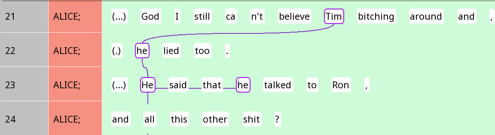

```{r, include = FALSE}
knitr::opts_chunk$set(
  collapse = TRUE,
  comment = "#>",
  warning = FALSE
)
options(rmarkdown.html_vignette.check_title = FALSE)
library(dplyr)
```

## Introduction to the tutorial

This tutorial is a sample project in `rezonateR` aiming to predict the length of referential expressions in natural discourse based on several discourse and grammatical factors. `rezonateR` is an R package mainly designed to import, organise and analyse data produced by the annotation and discourse visualisation software [Rezonator](http://rezonator.com/), which handles a variety of linguistic annotations, including span annotations, coreference chains, dependency trees, and more, with a focus on spoken discourse. `rezonateR` aims to simplify the process of working with Rezonator data using a wealth of built-in functions for data wrangling and feature engineering in R. This tutorial will cover some of the most important functions, including:

-   Importing a .rez file (the Rezonator data format) and reading annotations imported

-   Defining whether a token counts as a word

-   Deriving measures predictive of the choice of referential form (which may also be useful for a variety of other applications like coreference resolution)

-   Connecting information from dependency trees to information about coreference chains

-   Merging chunks (Rezonator's implementation of span annotations)

-   Doing automatic annotations within `rezonateR`, then exporting the results to a spreadsheet and importing it back into R

## Research question: Referent accessibility and referential choice

In this tutorial, we will be using Rezonator and `rezonateR` to address a research question using a simple sample data set: We will look at the relationship between the accessibility of a referent, i.e. the ease of cognitively 'getting at' a referent, and the choice of a linguistic expression used to refer to that form. Before elaborating on our research question, we will first introduce basic assumptions about the research topic.

In language, we often refer to different entities and concepts in the world: The people around us, the places we pass through, the things we see and remember. These things are called *referents*, and when we use linguistic expressions to refer to them, those linguistic elements are called *referential expressions*.

In the following example, we see a short snippet of conversation between two sisters from the text *A Tree's Life*, a conversation between two sisters from the Santa Barbara Corpus of Spoken American English (Du Bois et al. 2000). Just in this short passage, we can see different referential expressions:

{width="648"}

There are several examples of referential expressions in Figure 1. For example, in the first line in the screenshot (line 361), Mary refers to a cattle guard with the phrase *the first cattle guard you go over*. She refers back to it in line 363 using the expression *that*. In the same line 363, she also uses the expression *I* to refer to herself. Alice's reply mentions a new referent, *the tunnel* (366). All of these phrases refer to people or entities in the world.

In the above example, the same referent (the cattle guard) was referred to using two distinct expressions: a noun phrase with a relative clause *that first cattle guard you go over* (line 361) and a demonstrative pronoun *that* (line 363). When people do this, we say that they are tracking referents across different parts of the discourse. The relationship between two referential expressions with the same referent in a text is called *coreference*. Each referential expression may be referred to as a *mention* of a certain referent.

In the following image (Figure 2), we have marked up the two expressions referring to the cattle guard with green rectangles, and drawn a line between them, showing the coreference relation. The resulting structure, with lines linking up different referential expressions, is often referred to as a *coreference chain*:

{width="590"}

We do the same thing with the two appearances of the referential expression *the tunnel* in lines 366-367, since they refer to the same tunnel. This time, the referential expressions are enclosed by blue rectangles, and linked with a blue line to show the coreference relation:

{width="347"}

The next figure shows how the whole excerpt we have shown at the beginning would look like with all the coreference chains marked (including the first, truncated referential expression *the* in line 365):

{width="619"}

Up to now, we have seen that referential expressions come in many shapes and sizes: They can be heavily modified noun phrases like *that first cattle guard you go over*, or short one-word expressions like *that*. An important question is how humans make use of these different linguistic resources to refer to people and entities in the world.

It is often noted that in language, if a referent is more 'accessible', or more easily accessed mentally - for example, it is salient in the previous discourse or physical context - then we will tend to refer to it using a shorter and simpler form. Referents that are less accessible - for example, things that are mentioned for the first time - tend to be referred to using longer forms (e.g. Ariel 2001). In our first example, when the cattle guard was first mentioned, it was newly introduced to the discourse, and we see that Mary wasn't even sure that Alice remembers about it. It was thus not accessible. This likely motivated the use of a long referential expression, to help Mary retrieve the correct referent. But after Mary affirmed that she understood, it became a salient entity in the minds of both conversational partners, and when Mary refers to the cattle guard again, she switches to the shorter form *that*.

Thus, we should expect that in natural discourse, factors that render a referent more accessible are associated with shorter forms, and factors that make it less accessible are associated with longer forms. Figure 3 shows an example of this phenomenon where an entity is first mentioned as a full noun phrase, and by the end of the stretch of text is only mentioned by a pronoun. The coreference chain this time is in pink, with successive mentions linked by pink lines, like the other coreference chains we have seen before:

{width="604"}

When the concept of hard times was first mentioned, it was with a noun phrase *hard times* (line 159), and the same occurred again in the next line. But the third time it appeared, a pronoun *it* was used. Intuitively, *hard times* was quite prominent and therefore accessible by the third reference, and hence a shorter form was used.

Note that the word *they* in lines 158 and 159, although having the same form as *they* in line 162, is *not* linked, since these expressions are referring to a group of people, and not hard times. (To be exact, they are Alice's roommates.) We can draw a separate coreference chain for *they,* shown here in red instead of purple:

{width="660"}

In Figure 6, the fact that the roommates were referred to by the short and simple one-word expression *they* probably suggests that they were quite prominent in context. Indeed, in the context preceding these two lines, they have been mentioned numerous times, and were the main topic of discussion.

So far, we have talked about notions like accessibility and prominence in rather vague and general terms. But what exactly makes something more accessible, and therefore more likely to be referred to using a shorter form? To understand how exactly people choose referential expressions in natural discourse, we need to turn factors affecting accessibility into a more concrete, readily operationalisable form.

In this project, we will propose some factors that may increase accessibility (e.g. the number of times an entity has been recently mentioned), and then determine whether they are associated with the use of a shorter form in natural discourse. For example, if certain referents have just been mentioned a lot in the previous context, we might expect that they are relatively mentally accessible. If such referents are statistically more likely to be referred to using shorter, simpler forms - like the example of *they* that we have just discussed - then we have support for the idea that people choose to use shorter, simpler forms when referents are more accessible in discourse. This project is a preliminary investigation of this issue using a short snippet of conversation.

## What we will do

The aim of this article is to demonstrate, using a sample, highly simplified project, what type of analysis may be conducted using Rezonator and `rezonateR`. This particular example will examine the choice of referential forms in spoken dialogue: What factors lead to the choice of a longer form versus a shorter one? The following snippet of conversation (Figure 7), for example, has two referential expressions referring to the same entity - a dog - but the first one is a rather long noun phrase (*this darn dog*) while the second is a simple, one-word pronoun (*her*). Can we tell what factors are at play here that motivated the speaker's choice of referential expression?

{width="577"}

To this end, we will annotate each referential expression in the text using properties that we believe are related to accessibility, such as the number of times the referent has been mentioned recently, or whether the expression is the subject of a clause. We will then use this information and attempt to see whether some of these properties are associated with the use of shorter, simpler referential expressions and others with longer, more complex expressions.

The data here is the same as that used in the [series of detailed tutorials](https://rezonators.github.io/rezonateR/articles/import_save_basics.html) (`vignette("import_save_basics")`), but this article will have less focus on how to write the code, and more on showing you how to answer the sample research question using `rezonateR`. So don't worry if you don't understand the details of how the code works - that can come later, as you read the detailed tutorials and documentation.

This article does not assume that you have read any of the other articles on `rezonateR`. So there is some overlap in the topics covered. I will point you to other tutorials for further details when necessary. However, if you have not installed `rezonateR`, please do it now using this code:

+----------------------------------------+
| Installing rezonateR                   |
+========================================+
| ``` {r}                                |
| install.packages("devtools")           |
| library(devtools)                      |
| install_github("rezonators/rezonateR") |
| ```                                    |
+----------------------------------------+

You are welcome to follow this tutorial in R. If you are reading this in R using the file `sample_proj.Rmd`, you can simply click on the 'run' button (green 'play' icon on the top right of each box) to run the code. As long as all the code blocks are run sequentially, the code should work; otherwise, please [submit a ticket](https://github.com/rezonators/rezonateR/issues) on GitHub!

## What we will do in this tutorial

As we said above, our goal is to propose several factors that are potentially relevant to accessibility of referents in discourse, and see if they are associated with simpler referential forms. For the purposes of this tutorial, we will use orthographic length, or how many English letters there are in an expression, as a proxy for how 'simple' the referential forms will be, since this is the easiest to calculate. This acts as a proxy for phonological size, which is often claimed to be associated with accessibility: the more accessible an entity, the smaller the phonological size of the referential expression used (Ariel 2001). The orthographic length variable will be referred to as `charCount` in the code.

We will be building a model that predicts the `charCount` from several predictors in our small dataset, which include properties of the expression itself as well as its relation to the wider grammatical and discourse context. Here is a spoiler of the final set of factors, which we will explain in more detail as we go through the tutorial:

-   `noPrevSubjMentionsIn10`: The number of coreferent subject mentions within the 10 previous intonation units. That is, how many times was the referent of a form mentioned in the 10 previous intonation units in subject position?
-   `noPrevNonSubjMentionsIn10`: The number of coreferent non-subject mentions within the 10 previous intonation units. That is, how many times was the referent of a form mentioned in the 10 previous intonation units, outside of subject position?
-   `gapUnits`: How many intonation units are there between the previous mention and the current one?
-   `noCompetitors`: The number of competitors within the ten previous intonation units. That is, how many times were entities other than the referent of the current referential expression mentioned within the ten previous intonation units?
-   `seqInTrail`: The position of a mention in its coreference chain. That is, is it the first mention of something, or the second, third, etc.?
-   `Relation`: Is the current referential expression a subject?
-   `isPredOrFree`: Is the current mention either a nominal predicate (copula complement) or not tied to a particular clause?
-   `number`: Is the current referential expression singular or plural?

Thus, our goal within R is to create a data frame where each row corresponds to a referential expression, and the columns include all of these factors (plus `charCount`, the number of characters). This can be done easily using the `rezonateR` functions after inputting the raw Rezonator data.

## The input data from Rezonator

The first 162 lines have been annotated and will be used in this tutorial; they deal with the topic of one of the sisters' roommates. The data is also available through the `sbc007` object in the package itself, where a detailed description of the annotations included may be found. The full corpus, with text and audio files, can be downloaded at the [Santa Barbara Corpus page on the UC Santa Barbara Linguistics Department Website](https://www.linguistics.ucsb.edu/research/santa-barbara-corpus). The corpus in `.rez` format, the file format which is used by the Rezonator program and can be imported into R using `rezonateR`, is shipped with Rezonator, which can be downloaded on the [Rezonator website](http://rezonator.com/).

In this section, we will explore the basic structure of a Rezonator file using this text. More advanced data structures will be introduced later in the tutorial as the need arises.

### Units and tokens

Figure 8 shows an excerpt close to the beginning of the conversation in Rezonator:

{width="84%"}

In this file, each line is referred to as a *unit*, which in this context is an *intonation unit*, or a short burst of speech under a single intonation contour. In other research projects where we are working with other basic units such as the sentence, clause or other structure of similar length, we can set the Rezonator unit to those structures instead.

Each unit consists of a series of tokens separated by spaces. In this file, most of the tokens are English words, like *usually*, *I* and *do* in line 7 of the screenshot in Figure 8. Also considered tokens are contractions like *'nt* for *not* on lines 7 and 9 or *'s* for *is* on lines 10 and 12, which are considered separate tokens in this project even though they are not separated by whitespace from the previous token in English writing conventions.

However, there are also other elements that are considered tokens. For example, the symbol at the end of each line in the screenshot is called an *endnote* in the context of discourse-functional transcription (DFT), the transcription conventions used in the Santa Barbara Corpus. It denotes the intonational contour type of the intonation unit. In the line 7, the dash indicates that the intonation unit was truncated. In line 8, the period represents final (falling) intonation, whereas in line 10, the comma represents continuing intonation, which is associated with a relatively stable pitch near the end. Line 11 ends with a question mark indicating question intonation, which is associated with rising pitch near the end.

There are also other tokens that are not words, such as `(...)` in line 10, denoting a relatively long pause, or `@` in line 12, denoting a pulse of laughter. These transcription symbols are all considered tokens in this file, and together with actual words like *usually*, they are arranged into intonation units in Santa Barbara corpus transcriptions.

#### Tracks and trails

Coreference chains have been annotated in this file. In the Rezonator context, coreference chains are also known as *trails*. A trail consists of several mentions or referential expressions that refer to the same entity. Each of these individual referential expressions is called a *track*, and they are connected by wavy lines in Rezonator. We saw some examples of trails at the beginning of this tutorial. Here is another example:

{width="100%"}

In Figure 9, the proper name *Tim* and three instances of the pronoun *he* all refer to the same person, Tim, and hence are four *tracks* of the same purple *trail*.

#### Zeroes

When there is a clause with an implicit participant that is not overtly expressed in the linguistic form, this is often referred to as a *zero*. In this file, a zero is annotated whenever there is a participant that is implied by the verb, but not overtly expressed in the linguistic content. In the annotated .`rez` file we are working with, the symbol \<0\> is used to indicate such a zero. Zeroes are added to the same trail as referential expressions referring to the same entity. Here is an example where explicit referential expressions are placed in the same purple trail as a zero:

{width="604"}

Notice that the two occurrences of *I* on Line 2 in Figure 10 are linked together with a purple link. In the third line, the person who is implied to be staying up late is Mary herself, even though there is no explicit mention. Thus, a zero was inserted before *stay*, and added to the same trail as the two occurrences of *I*.

In Figure 10, the zero in line 4 does not refer back to *I*, but to the action of staying up late. Thus, it is not in the same chain, as indicated by the lack of a purple border around it (even though the fact that the purple line runs through the \<0\> might lead one to mistakenly believe that it belongs to the same chain). In fact, as shown in Figure 11, the \<0\> on line 4 belongs to the same chain as *this* on line 2 and *stay up late* on line 3, both of which refer to the action of staying up late:

{width="614"}

#### Chunks

A 'chunk' in a Rezonator is a sequence of tokens within a unit, often a type of phrase such as a noun phrase. In Rezonator, chunks are elements represented by rectangular outlines around one or more tokens.

There are two types of chunks. Some chunks correspond to tracks. For example, *stay up late* in the example we have just seen is a chunk. These chunks have rectangular borders of the same colour as the rest of the trail that they belong to:

{width="614"}

In the file we are working with, chunks corresponding to tracks are mostly referential expressions like pronouns and noun phrases. As is visible in Figure 12, we include predicates and clauses when there are referential expressions that co-refer with them; for example, *this* and *stay up late* both refer to the action of staying up late here.

The second type of chunks is called 'blank chunks'. These chunks do not belong to any trail and appear with grey rectangular borders with angled corners around them. In this file, verbal complexes are marked as blank chunks. The following figure shows some examples of these verbal chunks:

{width="666"}

In this example (Figure 13), auxiliaries, negation and similar elements expressing verbal categories are placed inside these verbal complexes, such as *wasn't gonna* in *wasn't gonna do*.

Chunks have been tagged for two properties inside Rezonator. The field `chunkType` is annotated as `verb` for verbs and left blank for referential expressions, allowing us to distinguish between the two when importing into `rezonateR` later. The field `largerChunk` is the larger chunk to which a chunk belongs, which will be discussed later. These two columns are shown in the navigation pane of Rezonator as follows:


In Figure 14, *said* and *wasn't gonna do* are verbal complexes and hence tagged as *verb* under `chunkType`, the first column on the right side of Figure 15 (without grey shading). The other expressions have blank values, indicating that they are referential expressions. The second column on the right side, `largerChunk`, is annotated for chunks 67 and 68 as '2', indicating that they are part of the same larger chunk that will be merged in `rezonateR`, as we will soon see.

## Importing the file

The first step is to import the file. When importing a file, an object called `rezrObj` is created. `rezrObj` contains two kinds of elements:

-   A `nodeMap`, which contains the data in the form of a series of interconnected nodes with attributes. For example, each token in a Rezonator file is represented by a node in the node map, which contains information such as the text of the token itself, its position inside the document, and so on.
-   A series of `rezrDF`s, which are data frames containing information about different elements of the file, such as tokens, units, trails and so on. Each row is one instance of that entity (token, unit, etc.) whereas each column gives an attribute of that entity.

In this tutorial, we will only work with `rezrDF`s. Some important `rezrDF`s include:

-   `tokenDF`, which contains the information about individual tokens of the original file

-   `unitDF`, which contains information about individual units

-   `chunkDF`, which contains information about chunks

-   `trailDF`, which contains information about trails (i.e. coreference chains).

-   `trackDF`, which contains information about entries of trails (i.e. mentions in coreference chains).

During the import process, we will need to specify two types of information:

-   **How to divide the chunks into layers**: Recall that there are two types of chunks in this file: referential expressions and verbs. We would like to keep this information in separate data frames so that we can easily access all chunks of each type in the same place, without being distracted by the other chunk type. So, we divide the chunks into two layers, `verb` and `refexpr` (for 'referential expressions', including the entire clauses we've seen before). Chunks in the two layers will be put into two separate `rezrDF`s.

    In some situations, it is useful to specify layers for other elements like tracks, trails and trees as well. In this tutorial, however, we only have one type of each of these elements. Since no layers are specified for `trackDF` and `treeDF`, there will be only one `rezrDF` for them, with the layer name `default`. The same applies to data frames associated with tracks and trees, including `trailDF` and `treeEntryDF`: They will all have a single layer named `default`, since there are no layers specified for them.

-   **Which fields of a token contains text to be concatenated:** When you are browsing data frames containing data structures above the level of a token, such as `chunkDF`or`unitDF`, you want to be able to see the text. For example, take the following line:

    {width="444"}

    When browsing the `unitDF`, you would want to see all the text in this unit, *(...) (H) I 'm also going to suggest ,*, in one of the columns. Similarly, when browsing `chunkDF`, you would want a column that gives you *'m also going to suggest*. Thus, we have to tell Rezonator where to look for the textual content of individual tokens so that they can be concatenated in the `rezrDF`s for higher structures like chunks and units.

Here is the full import code. The field `layerRegex` provides information about layers, and `concatFields` contains information about text concatenation.

```{r}
library(rezonateR)
path = system.file("extdata", "sbc007.rez", package = "rezonateR", mustWork = T)

layerRegex = list(chunk = list(field = "chunkType",
                               regex = c("verb"),
                               names = c("verb", "refexpr")))
concatFields = c("text", "transcript")
rez007 = importRez(path,
                   layerRegex = layerRegex,
                   concatFields = concatFields)
```

As examples of the content inside the imported object, here are the imported `chunkDF` members and `trackDF`. Notice that the `chunkDF` is divided into two (`refexpr` and `verb`):

```{r}
head(rez007$chunkDF %>% lapply(select, id, doc, text))
head(rez007$trackDF$default %>% select(id, doc, chain, token, text, gapWords, charCount))
```

More information about the import process, including how to specify the two pieces of information for import and the various objects created by the import process, can be found in the [detailed tutorial on imports and data structure](https://rezonators.github.io/rezonateR/articles/import_save_basics.html) (`vignette("import_save_basics")`).

Each line of the table `rez007$trackDF$default` above contains a referential expression whose size we want to predict. The goal of using `rezonateR` for this project will be to produce a version of the data frame `rez007$trackDF` that contains all the predictors and the dependent variable on each line, and may be fed to models such as `lm()`.

You can save the `rezrObj` with `rez_save()` so that it can be opened with `rez_load()` next time, saving you the trouble of importing again:

```{r}
savePath = "rez007.Rdata"
rez_save(rez007, savePath)
```

## Sequence and order of entities in discourse

After importing the file, there are a few simple operations that we usually call to add additional information to the table which was not added during the original import process, before beginning the process of editing. In this section, we will perform two actions that relate to the sequence and order of entities in discourse. We will first defining which tokens are 'words' and add corresponding sequence information, and adding unit sequence information to non-unit tables.

### Words vs tokens

By default Rezonator provides two fields related to the position of a token, which you will see in `tokenDF` as columns:

-   `docTokenSeq` - refers to the position of a token within the entire text
-   `tokenOrder` - refers to the position of a token within its unit (in this file, this refers to intonation units)

Structures that span multiple tokens, like chunks and units, have four token sequence-related fields:

-   `docTokenSeqFirst` - refers to the `docTokenSeq` of the first token. That is, what is the position of the first token of the chunk, unit, etc. within the text?
-   `docTokenSeqLast` - refers to the `docTokenSeq` of the last token. That is, what is the position of the last token of the chunk, unit, etc. within the text?
-   `tokenOrderFirst` - refers to the `tokenOrder` of the first token. That is, what is the position of the first token of the chunk, unit, etc. within the unit?
-   `tokenOrderLast` - refers to the `tokenOrder` of the last token. That is, what is the position of the first token of the chunk, unit, etc. within the unit?

Here are some examples:

```{r}
head(rez007$tokenDF %>% select(id, text, tokenOrder, docTokenSeq))
head(rez007$chunkDF$refexpr %>% select(id, text, tokenOrderFirst, tokenOrderLast,  docTokenSeqFirst, docTokenSeqLast))
```

These values count all tokens in the file, including non-word tokens. In the Santa Barbara Corpus text we are using, there are various types of non-word tokens that these values will count. For example, in the following screenshot:

{alt="Figure 7: Units and tokens." width="74%"}

Values like `doctokenSeq` include in their counting various tokens that are not exactly words. This includes endnotes (such as `,` and `.`), which, as we discussed before, denote the intonational contours of IUs. Also included are pauses like `(...)`, *vocalisms* - sounds we make during speech that are often considered paralinguistic such as `(H)` for in-breaths and `@@@` for laughter - and so on.

What if we want a version of fields like `tokenOrder` and `docTokenSeq` that excludes these non-word tokens, including just 'real' words like *stay* (line 9) and *midnight* (line 11)? To do this, we have to first tell Rezonator how to define what a 'word' is. We can use the function `addIsWordField()` to do this:

```{r}
rez007 = addIsWordField(rez007, kind == "Word")
```

This function adds a a column to the `tokenDF` that states whether a token is a word, and in addition, it adds the fields `wordOrder` and `docWordSeq` to `tokenDF` (and also its counterparts in places like `chunkDF` and `unitDF`, e.g. `wordOrderFirst`, `wordOrderLast`, `docWordSeqFirst`, `docWordSeqLast`). These are counterparts of the `token`-related fields we have seen above, except that these new fields discount non-real words, which get the value `0`. Here's an example in `tokenDF`:

```{r}
head(rez007$tokenDF %>% select(id, text, tokenOrder, docTokenSeq, wordOrder, docWordSeq))
```

### Unit sequence information

When browsing `rezrDF`s, it is helpful to find out what unit the element we are looking at belongs to (or units, if it spans multiple units). However, this information is not added to `rezrDF`s like `trackDF` or `chunkDF` by default. The function `addUnitSeq()` does this. Here, `unitSeqFirst` and `unitSeqLast` are added to `chunkDF` and `trackDF`, allowing us to see which units chunks and tracks belong to:

```{r}
rez007 = addUnitSeq(rez007, "track")
head(rez007$chunkDF$refexpr %>% select(id, text, unitSeqFirst, unitSeqLast))
```

For the details of these functions, see [the tutorial on time and sequence](https://rezonators.github.io/rezonateR/articles/time_seq.html) (`vignette("time_seq")`).

## Pass 1: Predicting orthographic length of referential expressions from lookback distance

After the initial process of importing and simple preprocessing, we are now ready to explore the data and test our research hypotheses.

Recall that we would like to explore how factors related to the accessibility of referents affects the length of the referential expression chosen. One common way of operationalising accessibility is *lookback distance*: When the referential expression was produced, how long has it been since the previous mention? In this section, we will use some default predictors created automatically by Rezonator: `gapUnits` and `gapWords`.

### `gapUnits`: Lookback distance in R

As you might have noticed when using Rezonator, Rezonator automatically calculates the distance (in terms of intonation units) from each track (mention) to the previous mention in the same trail (coreference chain). This variable is called `gapUnits`, and it is automatically imported from Rezonator into `rezonateR` in `trackDF`. The `gapUnits` value is `N/A` for first mentions of referents; otherwise it is a nonnegative integer.

As an example, let's look the trail for staying up late at the beginning of the conversation again:

{width="598"}

If we consider the zero on line 4, `gapUnits` is just 1, since the previous mention was right in the previous unit. The *it* in the last line, line 6, should have a `gapUnits` value of 2, since the previous mention was on line 4, which is two units away.

Because first mentions are usually not accessible in discourse when they are first introduced, we can expect that they would be referred to using longer noun phrases. Let's try to verify that this is the case. The following piece of code plots the length of first vs. non-first mentions in the text using a violin plot. The y-axis shows the number of characters inside each referential expression (`charCount`), and there are two violins: One for first mentions and one for non-first mentions. (Note that in this tutorial, the plot will be displayed immediately after the code producing it. Moreover, this tutorial will use some `tidyverse` functions, such as those from `ggplot2`; feel free to click on any functions that you do not recognise to see their documentation.)

```{r}
library(ggplot2)
rez007$trackDF$default %>%
  mutate(isFirst = case_when(gapUnits == "N/A" ~ "First",
                             T ~ "NonFirst")) %>%
  ggplot(aes(x = isFirst, y = log(charCount))) + geom_violin()
```

Clearly, we can see that first mentions have a much higher tendency to be referred to using a noun phrase that has more characters. In fact, non-first mentions are highly concentrated at the bottom of the graph with the shortest referential expressions, whereas first mentions are well spread out across the range of lengths.

Among the non-first mentions, can we also predict the character count from `gapUnits`? Let's again do a quick visualisation, excluding first mentions. In the following plot, the the y-axis is gives the character count, the x-axis the `gapUnits`, and the size of the dots in the graph indicates the number of referential expressions with that combination of `charCount` and `gapUnits`:

```{r}
rez007$trackDF$default %>%
  filter(gapUnits != "N/A", charCount > 0) %>%
  mutate(gapUnits = as.integer(gapUnits)) %>%
  ggplot(aes(x = gapUnits, y = charCount)) + geom_count()
```

Oh no, what's going on? It seems that `gapUnits` is not predicting what we would usually expect to see. Most of the long-`gapUnits` noun phrases are fairly light, and there are quite a few small-`gapUnits` phrases that are quite long. This seems to go against the usual expectation that a shorter lookback distance leads to higher accessibility and should be associated with shorter referential forms.

The bottom left of the above diagram was a little messy; we can log the character count to get a better view:

```{r}
rez007$trackDF$default %>%
  filter(gapUnits != "N/A", charCount > 0) %>%
  mutate(gapUnits = as.integer(gapUnits)) %>%
  ggplot(aes(x = gapUnits, y = log(charCount))) + geom_count()
```

There is still a slight visible pattern whereby longer gapUnits tends to be associated with shorter character counts, contrary to expectation.

In the rest of the tutorial, we will partially account for this weirdness (though some of it is certainly due to our small, biased dataset). But for now, let's try to apply a simple linear model to this data to see what happens when we try to predict the logged `charCount` from `gapUnits`. (Note: This is not the best model specification for the data we're looking at, but let's keep it simple for this tutorial.)

```{r}
pass1_model1 = rez007$trackDF$default %>%
  filter(gapUnits != "N/A", charCount > 0) %>%
  mutate(gapUnits = as.integer(gapUnits)) %>%
  lm(log(charCount) ~ gapUnits, .)
summary(pass1_model1)
```

As we can see, although there is a negative coefficient that says a larger `gapUnits` leads to a smaller character count (as expected from our graph - though contrary to our usual expectations), it is not significant.

### A finer-grained distance metric?

There is another value, `gapWords`, that is automatically calculated in Rezonator and calculates the number of tokens from the current mention to the previous one. Would this finer-grained measure be a better operationalisation of lookback distance than `gapUnits`? Let's try to make the same plot that we just did with logged `charCount`, except with `gapWords` instead of `gapUnits` on the x-axis:

```{r}
rez007$trackDF$default %>%
  filter(gapWords != "N/A", charCount > 0) %>%
  mutate(gapWords = as.integer(gapWords)) %>%
  ggplot(aes(x = gapWords, y = log(charCount))) + geom_count()

```

The pattern is not much clearer from the diagram this time than last time. We still don't see our expected effect: A shorter lookback distance should be associated with shorter referential expressions. Let's try to put `gapWords` again into the linear regression model:

```{r}
pass1_model2 = rez007$trackDF$default %>%
  filter(gapWords != "N/A", charCount > 0) %>%
  mutate(gapWords = as.integer(gapWords)) %>%
  lm(log(charCount) ~ gapWords, .)
summary(pass1_model2)
```

As we can see, there is little change with the linear model either: The negative coefficient indicates that a shorter `gapWords` is associated with longer referential expressions, contrary to usual expectations, although the relationship is not significant, with a p-value around 0.14.

There are ways we can potentially improve on these measures as well as other predictors of character count that we can potentially explore. We'll continue doing this throughout the tutorial.

## Pass 2: Adding predictors of referential expression length with EasyTrack

Having attempted to predict character count from predictors imported directly from Rezonator, let's try to derive some predictors using `rezonateR` functions too. This section will cover some basic functions in the `EasyTrack` series of functions, which is dedicated to analysing coreference phenomena. See the [tutorial on coreference](https://rezonators.github.io/rezonateR/articles/track.html) (`vignette("track")`) for details about them.

In particular, we will try to count the *number* of previous mentions instead of the distance to the previous mention, and also try to count the number of mentions to *different* entities in the surrounding context. We will also try to improve on `gapWords` to see if modifying its operationalisation a little will be more revealing of the effect of lookback distance.

### Counting previous mentions

Apart from the number of intonation units to the previous instance that an entity was mentioned, the number of previous mentions within a specified time window may also affect accessibility: An entity that was just mentioned in the previous intonation unit but never before that might conceivably be less accessible than one that was just mentioned in the previous intonation unit as well as several intonation units before that.

The function `countPrevMentions()` in `rezonateR` is one function we can use to count the number of times the referent of a referential expression was referred to in its previous context. In its simplest form, you can simply specify a window of units in which to look for referential expressions that corefer with the each mention.

In this example, we will look at a window of 10 previous units. Refer to the following example:

{width="586"}

If we consider the *it* on the last line (line 8), among the previous 10 units (actually seven, since there are only seven preceding units), there have been four mentions of the action of staying up late, so the value we expect to get from this function is 4. If we had set the window to five units instead, the value would be only 3, since the first mention on line 2, *this*, is not within the five-unit window.

We will add the previous mention count to the `trackDF` using the `rez_mutate()` function, which is part of the [TidyRez family](https://rezonators.github.io/rezonateR/articles/edit_tidyRez.html) (`vignette("edit_tidyRez")`). (We use this function rather than `dplyr::mutate()` in order to ensure that the resulting data frame will remain in the correct `rezonateR` format.) Here is the code, along with a line of code that displays the first couple of values of this predictor:

```{r}
rez007$trackDF$default = rez007$trackDF$default %>%
  rez_mutate(noPrevMentionsIn10 = countPrevMentions(10))
rez007$trackDF$default %>% select(id, text, noPrevMentionsIn10)  %>% slice(1:20)
```

Now that we have counted the number of previous mentions, let's try to draw a scatterplot, as we have done before, with the y-axis being character count and the x-axis giving the number of previous mentions in the ten preceding units:

```{r}
rez007$trackDF$default %>%
  filter(gapWords != "N/A", charCount > 0) %>%
  ggplot(aes(x = noPrevMentionsIn10, y = log(charCount))) + geom_count()

```

From the graph, we see that there *is* a tendency for character counts to be smaller when the number of previous mentions is greater, albeit somewhat weak. The very large referential expressions are absent when there are more than five previous mentions, and after about five mentions, we can see the modal character length decreasing as well.

Now let's fit a linear model plotting this predictor against logged `charCount`

```{r}
pass2_model1 = rez007$trackDF$default %>%
  filter(gapWords != "N/A", charCount > 0) %>%
  lm(log(charCount) ~ noPrevMentionsIn10, .)
summary(pass2_model1)
```

From the linear model, we also find that the number of previous mentions in the previous 10 units *is* a significant predictor at the 0.05 significance level. It seems that pure lookback distance is not enough - we need to look beyond the previous mention. This might be a suggestion that a single mention of something - even close by - is not sufficient warrant to produce a shorter expression. Instead, we need to consider how often it has been mentioned.

Now that we've tried two different operationalisations of the idea that something more prominent in the previous context should be more salient and referred to using a simpler form, let's try to explore other possible predictors of referential choice.

### Counting competitors

So far we have been focusing on previous mentions to the *same* referent as the referential expression we're trying to predict. But mentions to *other* entities might also affect the accessibility of a certain referent. If there are many mentions to entities other than the target entity we're trying to refer to, they might present distractions and *lower* the accessibility of the target entity. In this section, we will explore this possibility.

The function `countCompetitors()` is similar to `countPrevMentions()`, except that it counts the number of referential expressions that are *not* in the same coreference chain, i.e. compete for the interlocutors' attention. The syntax is similar to `countPrevMentions()`, with the extra argument `between`, which specifies whether you want to count only expressions between the current mention and the previous one.

We will again be using a window of 10 units, and will not be looking only at mentions between the current and previous one. Let's look at the first seven lines of the text again to see how many competitors the *it* on line 8, referring to staying up late, has:

{width="512"}

From the graph, there nine mentions previous mentions in the previous 10-unit window that belong to a different chain as *stay up late,* so we expect that the value we get from `countCompetitors()`will be 9.

We will add this value to the `trackDF` using the `rez_mutate()` function again. So let's try to add the number of competitors now:

```{r}
rez007$trackDF$default = rez007$trackDF$default %>%
  rez_mutate(noCompetitors = countCompetitors(windowSize = 10, between = F))
rez007$trackDF$default %>% select(id, text, noCompetitors)  %>% slice(1:20)
```

Now let's try to draw a scatterplot and fit a linear model, as we have done before:

```{r}
rez007$trackDF$default %>%
  filter(gapWords != "N/A", charCount > 0) %>%
  ggplot(aes(x = noCompetitors, y = log(charCount))) + geom_count()

```

If we focus on the bottom half of the graph where the bulk of the data are lying, there does seem to be a small effect where a greater number of competitors leads to the use of more characters. Above around 16 competitors, it is much less common to have very short (length \< 3) referential expressions. Let's put the number of competitors in our linear model now:

```{r}
pass2_model1 = rez007$trackDF$default %>%
  filter(gapWords != "N/A", charCount > 0) %>%
  lm(log(charCount) ~ noCompetitors, .)
summary(pass2_model1)
```

As we can see from here, there is a small effect whereby a larger number of competitors is associated the use of longer referential expressions, which is just as we expect. However, we shouldn't conclude so soon that the data supports our hypothesis that competitors affect accessibility.

There is good reason to believe that `noCompetitors` and `noPrevMentionsIn10` may be highly correlated, and thus some of the effect we see for `noCompetitors` may actually due to a confounding factor: the presence of previous mentions, or vice versa. This is because of there are more non-coreferring expressions in the previous units, there will tend to be fewer coreferential expressions, assuming that the number of referential expressions is relatively stable, i.e. our two competitors are negatively correlated are negatively correlated. The code below plots them in a graph and calculates the Pearson correlation coefficient:

```{r}
rez007$trackDF$default %>%
  filter(gapWords != "N/A", charCount > 0) %>%
  ggplot(aes(x = noCompetitors, y = noPrevMentionsIn10)) + geom_count() + ggtitle(paste0("Pearson correlation: ",
cor(rez007$trackDF$default$noCompetitors, rez007$trackDF$default$noPrevMentionsIn10)))
```

As we can see, there is a weak but clear negative correlation between the number of mentions and the number of compoetitors in the previous context. So let's try to put both in the model and how the results turn out:

```{r}
pass2_model3 = rez007$trackDF$default %>%
  filter(gapWords != "N/A", charCount > 0) %>%
  lm(log(charCount) ~ noCompetitors + noPrevMentionsIn10, .)
summary(pass2_model3)
```

As we can see, once we put both in the model, `noCompetitors` becomes the only significant predictor. Of course, this does not mean that `noPrevMentionsIn10` does not matter; we only have very low power, after all. In any case, both coefficient estimates are in the expected direction: The larger the number of previous mentions and smaller the number of competitors, the shorter the form.

In case lookback distance and number of recent mentions have independent effects, let's also try the lookback-based approach by adding `gapUnits` to the model as well:

```{r}
pass2_model4 = rez007$trackDF$default %>%
  filter(gapWords != "N/A", charCount > 0) %>%
  mutate(gapUnits = as.numeric(gapUnits)) %>%
  lm(log(charCount) ~ noCompetitors + noPrevMentionsIn10 + gapUnits, .)
summary(pass2_model4)
```

Interestingly, this time, all three predictors are significant or close to significant. The first two are in expected directions: having more competitors leads to longer referential expressions, whereas more recent mentions makes the form smaller. However, the `gapUnits` effect is still in the opposite direction as we expect: The greater the gap, the smaller the referential expression! This does not appear to make sense. We will continue to improve this model in the following sections to see what happens to `gapUnits`.

### Upgrading `gapWords`

There's an additional thing we could do. The `gapWords` in Rezonator actually has a couple of problems and unexpected behaviour. For example, it treats zeroes as belonging to the position you put the `<0>` in (which is arbitrary), and it counts non-words such as pauses, breaths or laughter, which you might not want to count.

To use the example of staying up late again, refer to the following screenshot:

{alt="Figure 11: Coreference chain for the action of staying up late" width="614"}

Currently, the `gapWords` value for the second mention, *stay up late*, would be 5. However, you might not want to count the period on line 2 or the pause and zero on line 3 in the calculation of `gapWords`.

Let's try to use the `rezonateR` function `tokensToLastMention()` instead to deal with these issues. In this sample code, we will treat `<0>` as belonging to the end of the intonation unit they are annotated at, and define `docWordSeqLast` as the token sequence used in calculation, thus discounting non-words:

```{r}
rez007$trackDF$default = rez007$trackDF$default %>%
  rez_mutate(gapWordsNew = tokensToLastMention(tokenOrder = docWordSeqLast,
                                               unitDF = rez007$unitDF,
                                               zeroProtocol = "unitFinal",
                                               zeroCond = (text == "<0>")))
rez007$trackDF$default %>% select(id, text, gapWordsNew)
```

Now we can put this new `gapWords` into the model:

```{r}
pass2_model5 = rez007$trackDF$default %>%
  filter(gapWords != "N/A", charCount > 0) %>%
  mutate(gapUnits = as.numeric(gapUnits)) %>%
  lm(log(charCount) ~ noCompetitors + noPrevMentionsIn10 + gapWordsNew, .)
summary(pass2_model5)
```

This has no significant effect, unfortunately, so it does not seem that `gapWords` is a useful predictor after all.

### Sequential position of tracks in trails

A final variable we could add to the model is the sequential position of a track within a trail, which might also contribute to accessibility in a different way by giving the overall discourse prominent, rather than just a local effect. We might expect that the second mention of a referent, for example, might be longer than a fifth mention. We can get this variable using `getPosInChain()`:

```{r}
rez007$trackDF$default = rez007$trackDF$default %>%
  rez_mutate(seqInTrail = getPosInChain(tokenOrder = docWordSeqLast))
rez007$trackDF$default %>% select(id, name, text, seqInTrail) %>% head
```

Now we can plot the character count against this value in a graph:

```{r}
rez007$trackDF$default %>%
  filter(gapWords != "N/A", charCount > 0) %>%
  ggplot(aes(x = seqInTrail, y = log(charCount))) + geom_count()
```

It does seem that larger character counts are much rare as the `seqInTrail` value gets larger. Let's put the variable inside our model and see what happens:

```{r}
pass2_model5 = rez007$trackDF$default %>%
  filter(gapWords != "N/A", charCount > 0) %>%
  mutate(gapUnits = as.numeric(gapUnits)) %>%
  lm(log(charCount) ~ noCompetitors + noPrevMentionsIn10 + gapWordsNew + seqInTrail, .)
summary(pass2_model5)
```

It turns out that `seqInTrail` is a significant variable, and in the expected direction: The farther along we are in a trail, the shorter the form of the referential expression. `noPrevMentionsIn10`, which we can expect is quite highly correlated to `seqInTrail` especially in smaller chains, is no longer significant.

Now that we have explored the `EasyTrack` family of functions a little bit, let us explore the other options in `rezonateR` that allow us to extract other types of predictors.

## Pass 3: Full analysis of predictors of orthographic length in our dataset

Now that we have seen how `rezonateR`can handle simple operations involving entities in context, let's move on to perform more complex operations within `rezonateR`and see how it can further our analysis of referential choice in the dataset. This section will showcase several features of `rezonateR`, including:

-   How to merge chunks spanning multiple units into larger chunks

-   How to handle information about argument structure

-   How to perform semi-automatic annotation in R, correct them outside of R, and then import them back in

### Merging chunks

You have likely suspected by now that there is something wrong with our `gapUnits` measure. And you would be correct! There *is* a mistake in how we have been approaching these calculations.

Let's look at some cases where `gapUnits` is very small, but `charCount` is mysteriously very large, and see what's wrong with them. We'll set the cutoff for `gapUnits` at 1, and the cutoff for `charCount` at 20.

```{r}
rez007$trackDF$default %>% filter(gapUnits <= 1, charCount > 20) %>% select(id, gapUnits, charCount, text)
```

Notice that some of these cases do not seem to be actual referential expressions. Some of these cases are legitimate; for example, *nobody fucks with my lifestyle* happens to have been referred to by a cataphorical *it*:

{width="437"}

Since this is a case of cataphora and one of the expressions is a full clause, it is not surprising that it throws a monkey wrench into our hypothesis that shorter `gapUnits` should lead to shorter orthographic length, which is largely based on expectations about *anaphora* - where expressions refer to things mentioned *before* them - not cataphora, where an expression points to something mentioned later in the utterance.

However, the case of *(...) in self assertiveness ,* is an error. The problem is that in Rezonator, it is not possible to create chunks that span multiple units. We can only create individual chunks for each unit. So in this screenshot, *a real good lesson for them ,*, *too ,*, and *(...) in self assertiveness ,* are three separate chunks, when they should really only be a single chunk:

{width="430"}

This created a situation where *(...) in self assertiveness* is mistakenly taken as long referential expression that occurred right after a previous mention *too ,*.

`rezonateR` is equipped with the ability to combine several chunks inside the file into one larger chunk. Before we do this, though, we need to spice up our data frames with information from trees, which will provide us with some of the information helpful for merging chunks together. This will also be helpful for other types of operations later on too, so let's take a look at this feature.

#### Adding tree information

In Rezonator, trees are structures used to indicate syntactic or semantic relationships between words/chunks and other words/chunks. Each tree starts from a *root*. When a word/chunk depends on another word/chunk, the first word/chunk is said to be a 'child' of the second one, and the second one is said to be a 'parent' of the first one.

In ths file we're working with, there are a number of two-layered trees that indicate argument structure of each verb. The 'root' of each tree is the verb, and the arguments are the children of that root. The following figure shows the argument structure of Line 4, with *defeats* as the root with three children: a zero subject, the object *the purpose of getting up in the morning*, and the adverb *kinda*:

{width="100%"}

The four 'nodes' in this tree are known as `treeEntry` objects in Rezonator, and the three links between them, shown by an arrow in the screenshot, is called a `treeLink`. These links are tagged with the field `Relation`. In this file, tree links are annotated as `Relation` = `"Subject"` when it indicates a subject-verb relation; otherwise `Relation` is left blank.

Inside Rezonator, there are no direct links between `treeEntry` objects and entities like tracks and chunks. The function `getAllTreeCorrespondences()` adds a column `treeEntry` to tables like `chunkDF` and `trackDF`, giving the ID of the corresponding entry in the table `treeEntryDF`. Here is an example:

```{r, message=FALSE}
rez007 = getAllTreeCorrespondences(rez007, entity = "track")
head(rez007$tokenDF %>% select(id, text, treeEntry))
head(rez007$chunkDF$refexpr %>% select(id, text, treeEntry))
head(rez007$trackDF$default %>% select(id, text, treeEntry))
```

This will be useful later on for other things as well, not just for merging chunks.

#### Merging chunks with trees vs. IDs

There are two functions for merging chunks in `rezonateR`:

-   `mergeChunksWithTree()`: If there is a treeEntry that corresponds to the concatenation of multiple chunks, then we merge those chunks. For example, in the screenshots below, *(H) \<0\> going to (...) our parents ,* and *and (...) \<0\> complaining about one another* are in separate chunks. However, they correspond to one single tree entry, as we can see here.

    {width="497"}

    {width="483"}

-   `mergeChunksWithIDs()`: We merge chunks by assigning IDs to individual chunks that indicate the merged chunk it is supposed to belong to. In this dataset, this is done in the field `largerChunk` on chunks. For example, the first chunk you create this way may have the ID 1, the second chunk 2, the third chunk 3 and so on. In this case, all the component chunks of the first complex chunk should have the value `1` for `largerChunk` and so on.

    We can use this technique in action for merging the same two chunks we saw in Figure 24:

    

The new chunks will be added to the bottom of `chunkDF`. In addition, `chunkDF` will have an extra column `combinedChunk` giving information about chunk combinations:

```{r}
rez007 = mergeChunksWithIDs(rez007, "largerChunk")
rez007 = mergeChunksWithTree(rez007)
#Show combined referential expressions
rez007$chunkDF$refexpr %>%
  filter(combinedChunk != "") %>%
  select(id, text, combinedChunk) #Showing only combined chunks and their members
```

The function `mergedChunksToTrack()` puts this information in the `trackDF` too:

```{r}
rez007 = mergedChunksToTrack(rez007, "default")
#Show combined track members
rez007$trackDF$default %>%
  filter(combinedChunk != "") %>%
  select(id, name, text, combinedChunk) #Showing only combined chunks and their members
```

### `gapUnits`, take two

Now that we have merged some of these chunks, it's time to redo the `gapUnits` value to exclude 'tracks' that are in fact just fragments of chunks that have now been merged. We can do this by using the `unitsToLastMention()` function. By setting the value of `exclFrag` to `TRUE` (i.e. excluding fragments of chunks), we create a new value of `gapUnits` that excludes these dubious mentions:

```{r}
rez007$trackDF$default = rez007$trackDF$default %>%
  rez_mutate(gapUnitsNew = unitsToLastMention(exclFrag = T))
```

This new value `gapUnitsNew` has an `NA` value for fragments of chunks, and also ignores them when calculating `gapUnits`. Let's try to plot the relationship between `gapUnitsNew` and `charCount` again:

```{r}
rez007$trackDF$default %>%
  filter(!is.na(gapUnitsNew)) %>%
  mutate(gapUnitsNew = as.integer(gapUnitsNew)) %>%
  ggplot(aes(x = gapUnitsNew, y = log(charCount))) + geom_count()
```

While we still can't see the expected effect, some of the outliers on the top left of the graph are now gone.

The `noPrevMentionsIn10` and `noCompetitors` columns can also be redone to ignore fragments:

```{r}
rez007$trackDF$default = rez007$trackDF$default %>%
    rez_mutate(noPrevMentionsIn10 = countPrevMentions(10,
                                    exclFrag = T))
rez007$trackDF$default = rez007$trackDF$default %>%
    rez_mutate(noCompetitors = countCompetitors(windowSize = 10, between = F,
                                                exclFrag = T))
rez007$trackDF$default = rez007$trackDF$default %>%
  rez_mutate(seqInTrail = getPosInChain(tokenOrder = docWordSeqLast, exclFrag = T))
```

Now with the corrected data, let's try to refit the linear model:

```{r}
pass3_model1 = rez007$trackDF$default %>%
  filter(!is.na(gapUnitsNew), charCount > 0) %>%
  lm(log(charCount) ~ noCompetitors + noPrevMentionsIn10 + gapUnitsNew + seqInTrail, .)
summary(pass3_model1)
```

This time, `noCompetitors` is still significant. The coefficient of `gapUnitsNew` is still in the 'wrong' direction, since a larger `gapUnitsNew` still leads to a smaller referential expression, but the effect is not significant. The predictor `noPrevMentionsin10` is also insignificant even though the estimate is in the expected direction: The more the number of previous mentions, the shorter the form. The predictor `seqInTrail` is remains significant and in the expected direction - the farther along in the chain, the shorter the form.

Are there any more predictors that we can consider testing? Let's consider the cases with small `gapUnits` but large character counts again. It turns out that many of them are **predicates** of copular clauses, like the following example, which has the very long expression *what I'm gonna tell him* coreferential to the subject *that*:

{width="530"}

There is in fact some discussion on whether predicates should count as referential expressions at all. Many annotation schemes, such as OntoNotes, exclude them, based on discussion in work like van Deemter & Kibble (2000); however, recent work has highlighted the potential referring value of referential expressions (e.g. Zeldes 2022). Here, we maintain the position that predicates should be marked as referential expressions.

On the other hand, very few of the long referential expressions with small `gapUnits` are subjects. This suggests that it will be informative to test the effect of grammatical relations. Subjects are likely to be biased towards shorter character counts, and predicates towards longer ones. The two following sections will add these elements. First we will add the `Relation` predictor, which is annotated in the data and tells whether a referential expression is the subject of a clause. Then we write code to automatically guess whether something is a predicate.

### Adding information about verbs and argument structure

Now let's add the `Relation` variable, which determines whether a certain referential expression is the subject of a verb, a factor frequently argued to be increasing accessibility (e.g. Arnold 2008). To do this, we use `addFieldForeign()`, which belongs to the `EasyEdit` family of functions covered in the [EasyEdit tutorial](https://rezonators.github.io/rezonateR/articles/edit_easyEdit.html) (`vignette("edit_easyEdit")`). Recall that we've put a `treeEntry` column in `trackDF` that gives the ID of the corresponding tree entry. The following code looks into `treeEntryDF`, finds the `Relation` value corresponding to a `treeEntry`, and adds it to `trackDF`, allowing us to know whether each referential expression is a subject:

```{r}
rez007 = rez007 %>%
  addFieldForeign("track", "default", "treeEntry", "default", "treeEntry", "Relation", "Relation", fieldaccess = "foreign")
head(rez007$track$default %>% select(id, chain, text, treeEntry, Relation))
```

We can also replace the `NA` values in `Relation` by `"NonSubj"`, and turn it into a factor with `stringToFactor()` so that it can be used in modelling:

```{r, message=FALSE}
rez007$trackDF$default = rez007$trackDF$default %>% 
  rez_mutate(Relation = coalesce(Relation, "NonSubj"), fieldaccess = "flex") %>%
  stringToFactor(c("Relation"))
```

We can now plot the `charCount` values of subjects and non-subjects:

```{r}
rez007$trackDF$default %>%
  filter(!is.na(gapUnitsNew)) %>%
  ggplot(aes(x = Relation, y = log(charCount))) + geom_violin()
```

The pattern overwhelmingly supports our hypothesis that subjects should be more accessible that nonsubjects, and hence be referred to using a shorter referential expression.

Now let's see what `Relation` turns up if we put it in the linear model:

```{r}
pass3_model2 = rez007$trackDF$default %>%
  filter(!is.na(gapUnitsNew), charCount > 0) %>%
  lm(log(charCount) ~ noCompetitors + noPrevMentionsIn10 + gapUnitsNew + seqInTrail + Relation, .)
summary(pass3_model2)
```

As we can see, subjects are likely to be far shorter than non-subjects. The variables `seqInTrail` and `noCompetitors` remain significant.

### Adding the effect of predicatehood

We can now also add a variable to pick out predicates. There's a quick and dirty way to guess which referential expressions are predicates: We can pick out those expressions that are arguments of copulas, i.e. have a copula in the column `verbText`, and also are not subjects. This will incorrectly pick out adjuncts of copula clauses, but those are infrequent enough in our sample that we can get away with it.

In addition, referential expressions that don't belong to any verb - so-called 'free NPs' (Helasvuo 2019), with 'free' meaning 'free from a verb' - are often also predicate-like in behaviour, such as the multiline chunk we've seen before:

{alt="Figure 6" width="430"}

So we can also include them as 'predicates' as good measure. Let's call the resulting column `isPredOrFree`. (Note that this incorrectly picks out phrases that are parts of prepositional phrases as well, but again, there are few enough of these that we can get away with it.)

The first step in this process is to add information about the verb to the `trackDF`. The following code adds two columns, `verbID` and `verbText`, to the `trackDF`, which tell us the chunk ID and text of the verb that the referential expression depends on (for example, in *I saw you*, the referential expressions *I* and *you* would contain information about *saw*). This process is a bit complicated; see the [tutorial on coreference](https://rezonators.github.io/rezonateR/articles/track.html) `vignette("track")` for a more detailed explanation of what's going on.

```{r}
rez007 = rez007 %>%
  addFieldForeign("track", "default", "treeEntry", "default", "treeEntry", "treeParent", "parent", fieldaccess = "foreign")
rez007$trackDF$default = rez007$trackDF$default %>%
  rez_left_join(rez007$chunkDF$verb %>% select(id, text, treeEntry),
                by = c(treeParent = "treeEntry"),
                suffix = c("", "_verb"),
                df2Address = "chunkDF/verb",
                fkey = "treeParent",
                df2key = "treeEntry",
                rezrObj = rez007) %>%
  rename(verbID = id_verb, verbText = text_verb)
rez007$trackDF$default %>% select(id, treeParent, verbID, verbText) %>% slice(1:20)
```

Here's the code for getting our variable `isPredOrFree` from this:

```{r}
rez007$trackDF$default = rez007$trackDF$default %>% rez_mutate(isPredOrFree = ((
  verbText %in% c("is", "was", "were", "are", "am", "'s", "'m", "'re") &
    is.na(Relation)
) | is.na(verbText)) %>% coalesce(F))
```

Now let's compare the character counts of referential expressions that are predicates or free, versus those that are not:

```{r}
rez007$trackDF$default %>%
  filter(!is.na(gapUnitsNew)) %>%
  ggplot(aes(x = isPredOrFree, y = log(charCount))) + geom_violin()
```

As we can see, there is somewhat of a tendency where predicates and free NPs are more likely to have very long character counts, compared to referential expressions that are neither predicative nor free.

So let's add `isPredOrFree` to the model to see if it works as a predictor:

```{r}
pass3_model2 = rez007$trackDF$default %>%
  filter(!is.na(gapUnitsNew), charCount > 0) %>%
  lm(log(charCount) ~ noCompetitors + noPrevMentionsIn10 + gapUnitsNew + seqInTrail + Relation + isPredOrFree, .)
summary(pass3_model2)
```

Unfortunately, `isPredOrFree` does not turn out to be a significant predictor, and the p-value is very large. Subjecthood, it seems, is enough.

### Splitting up `noPrevSubjMentions`

Let's see if we can improve upon our variables in any more ways. The first thing we could do is to split up `noPrevMentionsIn10` to see if there are differential effects of different types of previous mentions that we are ignoring. It is often proposed in the literature that subjects are more accessible than other types of arguments, and when the previous mention is a subject, the expression will subsequently be more accessible as well (e.g. Arnold 2008). So we could split up previous mentions into previous subjects and previous non-subjects to see whether they have different effects.

The function `countPrevMentionsIf()` counts the number of times that a referent was mentioned previously in a specified window of units, along with the `TidyRez` function `rez_mutate()` (note that for non-subjects, we allow `Relation` to be `NA`):

```{r}
rez007$trackDF$default = rez007$trackDF$default %>%
  rez_mutate(noPrevSubjMentionsIn10 = countPrevMentionsIf(10, Relation == "Subj", exclFrag = T),
             noPrevNonSubjMentionsIn10 = countPrevMentionsIf(10, Relation != "Subj" | is.na(Relation), exclFrag = T))
rez007$trackDF$default %>% select(id, noPrevSubjMentionsIn10, noPrevNonSubjMentionsIn10)  %>% slice(1:20)
```

Now that we've added these values to the table, we can rerun the linear model, but with `noPrevMentionsIn10` split up:

```{r}
pass3_model2 = rez007$trackDF$default %>%
  filter(!is.na(gapUnitsNew), charCount > 0) %>%
  lm(log(charCount) ~ noCompetitors + noPrevSubjMentionsIn10 + noPrevNonSubjMentionsIn10 + gapUnitsNew + seqInTrail + Relation + isPredOrFree, .)
summary(pass3_model2)
```

Unfortunately, splitting up `noPrevSubjMentions` does not help much.

### Adding information about number

Let's take a final crack at the problem by seeing whether number (singular vs plural) has an effect on referential choice. This involves some manual annotation, which will have to be done outside of R. Our steps are as follows:

1.  We will first take a guess at what the grammatical number of a track in `rez007$trackDF` is using a set of simplistic rules based on the linguistic form.
2.  Then we export a `.csv` file from `rezonateR`, and edit the automatic guesses in Microsoft Excel (or any other spreadsheet program of your choice).
3.  We then import the `.csv` file back into `rezonateR` and update `rez007$trackDF` from the imported file.

Let's say we want to annotate the grammatical number of the referential expressions inside `trackDF$default`. A good approximation will be to:

-   mark everything that ends with \<s\> as plural, along with common plural pronouns and demonstratives

-   mark coordinate noun phrases as plural

-   mark noun phrases with singular demonstratives as singular

-   mark *you* and zeroes as uncertain

-   mark the rest as singular.

The following code performs these actions:

```{r}
rez007$trackDF$default = rez007$trackDF$default %>% rez_mutate(number = case_when(
  str_detect(text, " and ") ~ "pl",
  str_ends(text, "s") ~ "pl",
  str_detect(tolower(text), "(these|those)") ~ "pl",
  str_detect(tolower(text), "(this|that)") ~ "sg",
  tolower(text) %in% c("we", "they", "us", "them") ~ "pl",
  tolower(text) %in% c("you", "<0>") ~ "?",
  T ~ "sg"
))
head(rez007$trackDF$default %>% select(id, name, text, number))
```

Before we export this as a `.csv` for annotation, I would like to add a column inside the `trackDF` that gives us the transcription of the entire unit. It will be useful to be able to see this column while making manual annotations, such as when dealing with zero mentions. To simplify, we will just get the last unit even for multi-line chunks. Here is the code. We are using `rez_left_join()`, another TidyRez function, and extracting the `text` column of the unit whose `unitSeq` in `unitDF` corresponds to the `unitSeqLast` of a referential expression in `trackDF`:

```{r}
rez007$trackDF$default = rez007$trackDF$default %>%
  rez_left_join(rez007$unitDF %>% rez_select(unitSeq, text),
                by = c(unitSeqLast = "unitSeq"),
                suffix = c("", "_unit"),
                df2key = "unitSeq",
                rezrObj = rez007,
                df2Address = "unitDF",
                fkey = "unitSeqLast") %>%
  rez_rename(unitLastText = text_unit)
head(rez007$trackDF$default %>% select(id, unitLastText, text))
```

Here, *I said I wasn't gonna do this anymore .* is the full unit text of the first three referential expressions (the two *I*s and *this*), which is why it appears three times in the table.

We then write the `csv` file. We only export a subset of the columns in the `trackDF` so that our screen is cleaner and easier to work with:

```{r}
rez_write_csv(rez007$trackDF$default, "rez007_refexpr.csv", c("id", "unitLastText", "tokenOrderLast", "text", "name", "number"))
```

An editing best practice is to copy the `.csv` file and edit from the copy, rather from the `.csv` you export directly. Figure 7 shows what the exported `.csv` looks like in Excel:

{width="100%"}

After editing the CSV in a spreadsheet program to fix the mistakes and get rid of the ?s, we import it back using `rez_read_csv()` (specifying the original `rezrDF` makes the import processes smoother and less error-prone):

```{r}
changeDF = rez_read_csv("rez007_refexpr_edited_sampleproj.csv", origDF = rez007$trackDF$default)
```

Finally, we use the `updateFromDF()` function to change the `number` column:

```{r}
rez007$trackDF$default = rez007$trackDF$default %>%
  updateFromDF(changeDF, changeCols = "number")
head(rez007$trackDF$default %>% select(id, text, number))
```

Now let's graph the difference between the singulars and plurals in a graph:

```{r}
rez007$trackDF$default %>%
  filter(!is.na(gapUnitsNew), !is.na(number)) %>%
  ggplot(aes(x = number, y = log(charCount))) + geom_violin()
  
```

Singulars seem to be more concentrated towards the smaller character counts, but at the same time have more outliers that are very heavy. Let's put these in the model and see what happens:

```{r}
pass3_model3 = rez007$trackDF$default %>%
  filter(!is.na(gapUnitsNew), charCount > 0) %>%
  lm(log(charCount) ~ noCompetitors + noPrevSubjMentionsIn10 + noPrevNonSubjMentionsIn10 + gapUnitsNew + seqInTrail + number + Relation + isPredOrFree, .)
summary(pass3_model3)
```

Whether the current mention is a subject continues to turn out to be a good predictor, as does the sequence of a mention in the trail. The rest of the predictors are not significant, though some of them (particularly the number of competitors) may hold some promise on a larger dataset. Grammatical number does not seem particularly promising.

## A post-mortem: Where did all the effects go?

It may be disappointing that only two predictors, the sequence of a track in the trail and the subject/non-subject contrast, were significant. Even though we know from previous studies that previous mentions are generally important in determining the choice of referential form, only the order of a track in the trail turned out to be significant, and other context-related variables did not.

Of course, our power is very small because of the tiny sample size, and we have only been studying a small portion of a single text, which may have unusual properties. So what might those unusual properties be? Let's explore the data a little more to find out.

Let's start with the lengths of the chains. A text with little coreference will naturally have fewer referents that have been mentioned enough times to become accessible. The `chainSize` column of `trailDF` gives us the chain size, so we can plot it as a histogram:

```{r}
rez007$trailDF$default %>% ggplot(aes(x = chainSize)) + geom_histogram(binwidth = 1) + scale_x_continuous(breaks = seq(1, 40, 2))
```

We have a small number of very long chains, a small number of moderately-sized chains, and a very large number of short (1-3) chains - and this is ignoring the fact that some of these lengths are longer than the real length, because they contain chunks that are two parts of a larger, multi-unit chunk.

Now let's look at the top chains - say, the ones with more than 10 tracks. What are they? We can extract them from `trailDF` first, then explore the corresponding tracks in the `trackDF`:

```{r}
longestChains = rez007$trailDF$default %>% filter(chainSize > 10) %>% pull(id)
rez007$trackDF$default %>% filter(chain %in% longestChains) %>% select(name, text) %>% group_split(name) %>% head
```

As we can see in this table, the top referents are all humans, and they are mostly referred to using pronouns. 'I' and 'you', in particular, are virtually always pronouns, since they are the two speech act participants, so there is little distinction between longer and shorter referential expressions. Moreover, 'Tim' happens to be a very short name - with the same number of letters as 'him', in fact. These four chains make up so much of the proportion of the data that naturally, whatever effects we end up finding are small.

The fact that 'Tim' (and in fact many other names in this text, like Ron and Mary) are orthographically short also compels us to consider other dimensions of accessibility theory. In this project, our response measure is orthographic length, which is a proxy for phonological length. As defined by Ariel (2001), however, the form-function correlations claimed by accessibility theory are not based on phonological size alone. There are also two other dimensions: informativity (amount of lexical information contained), rigidity (ability of a form to pick a unique referent). Because forms like *Tim* are more rigid and informative than forms like *him*, it stands to reason that a dependent measure based on informativity and/or rigidity may reveal greater effects in this particular text snippet than phonological size.

## Conclusion

In this tutorial, we have explored the topic of referent accessibility and referential choice using a small snippet of natural conversation. We derived a number of predictors hypothesised to be associated with higher accessibility, and explored their relationship with the length of referential expressions. We have seen that there is a large discrepancy between subjects and non-subjects - subjects tend to be much shorter than non-subjects - as well as an effect of position in the coreference chain - that is, the more times a referent has been mentioned before, the shorter the form used to refer to it. We have also discussed why other factors do not seem to have much of an effect in our small sample.

In the process, we have explored many of the major features of `rezonateR`. We have explored the structure of a Rezonator file, and imported a file into `rezonateR`. We have explored the various ways that the sequence and order of entities in discourse are represented in `rezonateR`. We have explored the use of functions for deriving predictors related to the context preceding a referential expression, such as the number of previous mentions, the number of competitors, and the sequential position of an entity in a chain. We have seen how to merge chunks spanning multiple units in Rezonator and add information from trees in Rezonator. We have also done some automatic annotation in `rezonateR`, exported a table containing those automatic annotations, did some manual corrections in a spreadsheet, and imported the results back into `rezonateR`. Throughout this process, we used a number of functions from different parts of `rezonateR`, and applied it to a real research question.

## Where to go from here?

This simple project shows most of the basic capabilities of `rezonateR`, though it still leaves out a lot, such as *reloads*, which allow you to update certain column automatically after changing other columns. The series of tutorials, starting from an introduction to [imports, saving and data structure](https://rezonators.github.io/rezonateR/articles/import_save_basics.html) (`vignette("import_save_basics")`), is based on the same dataset as this tutorial, but covers most functionality of the package down to the smallest details, and you can pick and choose topics from there to read. If you are already familiar with using Rezonator, the [overview](https://rezonators.github.io/rezonateR/articles/overview.html) (`vignette("overview")`) is a less topically focused overview that tells you how `rezonateR` can support your Rezonator work, covering more topics about different aspects of `rezonateR`. Good luck!

## References

Ariel, Mira. 2001. Accessibility theory: An overview. In Ted Sanders, Joost Schilperoord & Wilbert Spooren (eds.), *Text representation: Linguistic and psycholinguistic aspects (Human Cognitive Processing)*, 29--87. Amsterdam: John Benjamins Publishing Company. <https://doi.org/10.1075/hcp.8.04ari.>

Arnold, Jennifer E. 2008. Reference production: Production-internal and addressee-oriented processes. *Language and Cognitive Processes* 23(4). 495--527. <https://doi.org/10.1080/01690960801920099.>

Du Bois, John W., Wallace L. Chafe, Charles Meyer, Sandra A. Thompson & Nii Martey. 2000. Santa Barbara Corpus of Spoken American English. CD-ROM. Philadelphia: Linguistic Data Consortium. Linguistic Data Consortium.

Helasvuo, Marja-Liisa. 2019. Free NPs as units in Finnish. *Studies in Language* 43(2). 301--328.

Zeldes, Amir. 2022. Can we fix the scope for coreference?: problems and solutions for benchmarks beyond OntoNotes. *Dialogue Discourse* 13(1). 41--62.

van Deemter, Kees & Rodger Kibble. 2000. On coreferring: Coreference in MUC and related annotation schemes. *Computational linguistics*. 26(4). 629--637.

+------------------------------------------------------------------------------------------------------------------------------------------------------------------------------------------------------------------------------------------------------------------------------------------------------------------------------------------------------------------------------------------+
| Further reading                                                                                                                                                                                                                                                                                                                                                                          |
+==========================================================================================================================================================================================================================================================================================================================================================================================+
| Ariel, Mira. 1994. Interpreting anaphoric expressions: A cognitive versus a pragmatic approach. *Journal of Linguistics*. 30(1). 3--42.                                                                                                                                                                                                                                                  |
|                                                                                                                                                                                                                                                                                                                                                                                          |
| Almor, Amit, Jefferson de Carvalho Maia, Maria Luiza Cunha Lima, Mirta Vernice & Carlos Gelormini-Lezama. 2017. Language processing, acceptability, and statistical distribution: A study of null and overt subjects in Brazilian Portuguese. *Journal of Memory and Language* 92. 98--113. <https://doi.org/10.1016/j.jml.2016.06.001.>                                                 |
|                                                                                                                                                                                                                                                                                                                                                                                          |
| Arnold, Jennifer E. 2010. How speakers refer: The role of accessibility. *Language and Linguistics Compass* 4(4). 187--203.                                                                                                                                                                                                                                                              |
|                                                                                                                                                                                                                                                                                                                                                                                          |
| Brennan, Susan E. 1995. Centering attention in discourse. *Language and Cognitive Processes* 10(2). 137--167. <https://doi.org/10.1080/01690969508407091.>                                                                                                                                                                                                                               |
|                                                                                                                                                                                                                                                                                                                                                                                          |
| Chen, Guanyi, Fahime Same & Kees van Deemter. 2023. Neural referential form selection: Generalisability and interpretability. Computer Speech & Language 79. 101466. <https://doi.org/10.1016/j.csl.2022.101466.>                                                                                                                                                                        |
|                                                                                                                                                                                                                                                                                                                                                                                          |
| Gordon, Peter C., Barbara J. Grosz & Laura A. Gilliom. 1993. Pronouns, names, and the centering of attention in discourse. *Cognitive Science* 17(3). 311--347.                                                                                                                                                                                                                          |
|                                                                                                                                                                                                                                                                                                                                                                                          |
| Gundel, Jeanette K., Nancy Hedberg & Ron Zacharski. 1993. Cognitive status and the form of referring expressions in discourse. *Language.* 274--307.                                                                                                                                                                                                                                     |
|                                                                                                                                                                                                                                                                                                                                                                                          |
| Kibrik, Andrej A., Mariya V. Khudyakova, Grigory B. Dobrov, Anastasia Linnik & Dmitrij A. Zalmanov. 2016. Referential Choice: Predictability and Its Limits. *Frontiers in Psychology*. Frontiers 7. <https://doi.org/10.3389/fpsyg.2016.01429>.                                                                                                                                         |
|                                                                                                                                                                                                                                                                                                                                                                                          |
| Same, Fahime & Kees van Deemter. 2020. A Linguistic Perspective on Reference: Choosing a Feature Set for Generating Referring Expressions in Context. In Proceedings of the 28th International Conference on Computational Linguistics, 4575--4586. Barcelona, Spain (Online): International Committee on Computational Linguistics. <https://doi.org/10.18653/v1/2020.coling-main.403.> |
+------------------------------------------------------------------------------------------------------------------------------------------------------------------------------------------------------------------------------------------------------------------------------------------------------------------------------------------------------------------------------------------+
