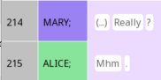
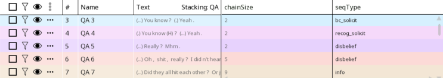
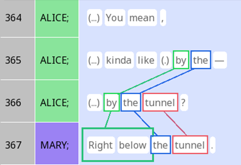
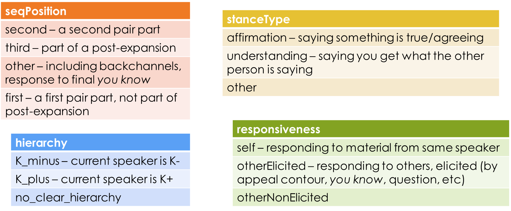

This tutorial accompanies the SEMDIAL poster abstract on `rezonateR` by showing how everything was coded.

```{r}
library(tidyverse)
library(rezonateR)
sbc007_qa <- importRez("sbc007_adj_pair.rez", concatFields = c("text", "transcript"))
```

# The dataset

Several annotations have been made in the dataset we used for this study. Firstly, all question-answer sequences in the text have been marked as stacks. This includes anything that is formally marked by lexico-grammatical means as a question, including through formulaic expressions like *you know?* and *really?*. When the speaker is K- and makes a statement that is clearly a question, that is included as well; I exclude, however, cases where a K+ speaker produces a grammatical declarative with rising intonation, since those seem to have lower expectations for a response.

Here is an example of how a question and an answer may be marked as a stack:

{width="168"}

The `seqType` variable that gives the specific type of question. This particular stack is tagged as a ritualised expression of surprise; the annotation is shown below along with a few others:



Resonance was marked throughout the text, including within question-answer pairs:

{width="252"}

Finally, each instance of the words *yeah* and *mhm* is manually annotated for some features in Rezonator:



# Adding participant information

Let's first add participant (speaker label) information to the cards DF:

```{r}
sbc007_qa = sbc007_qa %>%
  addFieldForeign("token", "", "unit", "", "unit", "participant", "participant")
sbc007_qa = sbc007_qa %>%
  addFieldForeign("card", "QA", "unit", "", "unit", "participant", "participant")

```

We can now determine whether each Q&A has Mary or Alice as the asker like this:

```{r}
sbc007_qa_asker_byseq = sbc007_qa$cardDF$QA %>%
  group_by(chain) %>%
  summarise(asker = participant[which(actionType == "question")[1]]) %>%
  ungroup
```

Now let's put this info in the stack DF again:

```{r}
sbc007_qa$stackDF$QA = sbc007_qa$stackDF$QA %>%
  rez_left_join(sbc007_qa_asker_byseq,
                by = c(id = "chain"),
                fieldaccess = "flex")
```

# Adding resonance information

Find number of resonances between questions and answers:

```{r}
getResonacesBetweenQA = function(actionType, unit){
  findResonancesBetween(sbc007_qa, list(unit[actionType == "question"]), list(unit[actionType == "answer"]))
}
sbc007_qa = addUnitSeq(sbc007_qa, "rez", "default")

sbc007_countrez_qa = sbc007_qa$cardDF$QA %>%
  group_by(chain) %>%
  summarise(resonances = getResonacesBetweenQA(actionType, unit)) %>%
  ungroup()
```

Now let's put this info in the stack DF again:

```{r}
sbc007_qa$stackDF$QA = sbc007_qa$stackDF$QA %>%
  rez_left_join(sbc007_countrez_qa,
                by = c(id = "chain"),
                fieldaccess = "flex")
```

Now we can look at resonances by question type:

```{r fig.height=2, fig.width=4}
sbc007_qa$stackDF$QA %>%
  filter(resonances > 0) %>%
  ggplot(aes(y = resonances, x = seqType)) +
  geom_col() +
  scale_x_discrete(labels = c("Assessment\nsolicitation", "Candidate\nco-construction", "Confirmation\nrequest", "Info-seeking\nquestion"),
                   name = "Type of Q-A sequence") +
  scale_y_continuous(breaks = seq(0,8,2))
```

# Word cloud

We will first do a few preparatory steps:

```{r fig.height=2, fig.width=4, warning=FALSE}
library(ggwordcloud)
#Add QA stack sequence numbers to token DF
sbc007_qa = stackToToken(sbc007_qa, "QA")

#Add seqType to the token DF as well
sbc007_qa = addFieldForeign(sbc007_qa,
                            "token", "", "stack", "QA",
                            "QASeq", "seqType",
                            sourceKeyName = "stackSeq")

#Determine which tokens are actual words, as opposeed to e.g. punctuation
sbc007_qa = sbc007_qa %>% addIsWordField(kind == "word")
```

Now we can look at the word clouds, highlighting interjections:

```{r fig.height=3, fig.width=7, message=FALSE, warning=FALSE}
#Get the commonest part of speech of a word in the text
getCommonest = function(char){
  summ = as.factor(char) %>% summary
  names(summ[summ == max(summ)][1])
}

sbc007_qa$tokenDF %>%
    filter(!is.na(seqType), kind == "word")  %>%
    mutate(seqType = as.factor(seqType),
           textLower = as.factor(tolower(text))) %>%
    group_by(seqType, textLower) %>%
  summarise(POS_dft = getCommonest(POS_dft), n = n()) %>%
  mutate(POS_dft = case_when(textLower %in% c("yeah", "yes", "mhm", "right", "unhunh") ~ "ITJ")) %>%
  ungroup() %>%
  filter(seqType %in% c("info","disbelief", "recog_solicit")) %>%
      ggplot(aes(label = textLower, size = n, col = POS_dft)) +
  geom_text_wordcloud() +
  theme_minimal() +
  theme(legend.position = "top") +
  scale_x_continuous(expand = c(0,0)) +
  facet_wrap("seqType", labeller = as_labeller(c(disbelief = "Ritualised\ndisbelief", info = "Information\nseeking",
                                                 recog_solicit = "Solicitation of\nrecognition")))

```

# Gantt chart

This produces the Gantt chart shown in the abstract:
```{r}
#Getting participant information in stacks:
sbc007_qa = sbc007_qa %>% addFieldForeign("card", "Turn", "unit", "", "unit", "participant", "participant")
sbc007_qa = sbc007_qa %>% addFieldForeign("stack", "Turn", "card", "Turn", "card", "participant", "participant", type = "complex", complexAction = function(x) paste0(unique(x), collapse = ","))


getGantt(sbc007_qa, x = "token", obj = "stack", stacking = "Turn")+ theme(axis.title = element_blank()) +
  geom_point(data = sbc007_qa$tokenDF %>%
               filter(tolower(text) %in% c("yeah", "mhm")) %>%
               mutate(docTokenSeqLast = docTokenSeq,
                      docTokenSeqFirst = docTokenSeq),
             aes(y = participant, x = docTokenSeq,
                 col = tolower(text),
                 shape = tolower(text)),
             size = 3) + theme(legend.position = "none") +
  scale_shape_manual(breaks = c("mhm", "yeah"),
                     values = c("M", "Y"))

```

# Clustering

This code derives the non-manually-created features for the yeah/mhm dataset:
```{r message=FALSE, warning=FALSE}
#Get lowercase words
sbc007_qa$tokenDF <- sbc007_qa$tokenDF %>% rez_mutate(textLower = tolower(text))

#Get unit and turn lengths in the token DF
sbc007_qa$tokenDF = 
    sbc007_qa$tokenDF %>%
    rez_group_by(unit) %>%
    rez_mutate(unitLen = sum(isWord)) %>%
    rez_ungroup()

sbc007_qa = stackToToken(sbc007_qa, "Turn")
sbc007_qa$tokenDF = 
    sbc007_qa$tokenDF %>%
    rez_group_by(TurnSeq) %>%
    rez_mutate(TurnLen = sum(isWord)) %>%
    rez_ungroup()

#Get positions of IUs within turns, words within IUs (counting from the front (order) and counting from the back (back))
sbc007_qa$tokenDF = 
    sbc007_qa$tokenDF %>%
    rez_mutate(TurnOrder = getOrderFromSeq(TurnSeq, isWord = isWord))
sbc007_qa$tokenDF = sbc007_qa$tokenDF %>%
    rez_mutate(unitBack = case_when(
      isWord ~ unitLen - wordOrder + 1,
      T ~ 0))
sbc007_qa$unitDF <- sbc007_qa$unitDF %>%
    rez_mutate(TurnOrder = getOrderFromSeq(TurnSeq)) %>%
    rez_group_by(TurnSeq) %>%
    rez_mutate(TurnLen = max(TurnOrder)) %>%
    rez_ungroup() %>%
    rez_mutate(TurnBack = TurnLen - TurnOrder + 1)

#Getting the positions of units within turns to the token DF:
sbc007_qa = sbc007_qa %>%
    addFieldForeign("token", "", "unit", "",
                    "unitSeq", "unitTurnOrder", "TurnOrder",
                    sourceKeyName = "unitSeq")  %>%
    addFieldForeign("token", "", "unit", "",
                    "unitSeq", "unitTurnLen", "TurnLen",
                    sourceKeyName = "unitSeq") %>%
    addFieldForeign("token", "", "unit", "",
                    "unitSeq", "unitTurnBack", "TurnBack",
                    sourceKeyName = "unitSeq")


```

Get vector forms of properties:

```{r}
yeah_mhm_sbc007 = sbc007_qa$tokenDF %>% filter(textLower %in% c("yeah", "mhm"))

yeah_mhm_sbc007_vector =
  data.frame(
    hierarchy = case_when(
      yeah_mhm_sbc007$hierarchy == "K_plus" ~ 1,
      yeah_mhm_sbc007$hierarchy == "K_minus" ~ 0,
      T ~ .5
    ),
    responsiveness = case_when(
      yeah_mhm_sbc007$responsiveness == "otherElicited" ~ 1,
      yeah_mhm_sbc007$responsiveness == "self" ~ 0,
      T ~ .5
    ),
    seqPosition_second = .5 * (yeah_mhm_sbc007$seqPosition == "second"),
    seqPosition_third = .5 * (yeah_mhm_sbc007$seqPosition == "third"),
    seqPosition_other = .5 * (yeah_mhm_sbc007$seqPosition == "other"),
    stanceType_second = .5 * (yeah_mhm_sbc007$stanceType == "affiliation"),
    stanceType_third = .5 * (yeah_mhm_sbc007$stanceType == "understanding"),
    stanceType_other = .5 * (yeah_mhm_sbc007$stanceType == "other"),
    wordOrder = yeah_mhm_sbc007$wordOrder / max(yeah_mhm_sbc007$wordOrder),
    back = as.integer(yeah_mhm_sbc007$back) / max(as.integer(yeah_mhm_sbc007$back)),
    unitTurnOrder = log(yeah_mhm_sbc007$unitTurnOrder) / max(log(yeah_mhm_sbc007$unitTurnOrder)),
    unitTurnBack = log(yeah_mhm_sbc007$unitTurnBack) / max(log(yeah_mhm_sbc007$unitTurnBack))
  )

yeah_mhm_sbc007 = yeah_mhm_sbc007 %>% group_by(textLower) %>% mutate(idNew = paste0(textLower, "_", 1:n())) %>% ungroup
rownames(yeah_mhm_sbc007_vector) = yeah_mhm_sbc007 %>% pull(idNew)

```

Do hierarchical clustering and cut tree:

```{r}
distMatrix = dist(yeah_mhm_sbc007_vector, method = "manhattan")
yeah_mhm_clusters = hclust(distMatrix)
yeah_mhm_sbc007 = yeah_mhm_sbc007 %>%
  mutate(clusters_5 = cutree(yeah_mhm_clusters, k = 5)) %>%
  mutate(clusters_2 = cutree(yeah_mhm_clusters, k = 2)) %>%
  mutate(category_fine = case_when(
    clusters_5 == 1 ~ "Self",
    clusters_5 == 2 ~ "Backchannel",
    clusters_5 == 3 ~ "NonInfoSPP",
    clusters_5 == 4 ~ "PostExp",
    clusters_5 == 5 ~ "InfoSPP"
  ) %>%
    factor(levels = c("Backchannel", "Self", "NonInfoSPP", "PostExp", "InfoSPP"))) %>%
  mutate(category_coarse = case_when(
    clusters_2 == 1 ~ "Regulatory",
    clusters_2 == 2 ~ "Substantive"
  )) %>%
  mutate(path = paste0(category_coarse, "-", category_fine),
         base = 1)
```

Draw Sankey diagram:

```{r message=FALSE, warning=FALSE}
library(ggforce)
yeah_mhm_all_ggforce = yeah_mhm_sbc007 %>%
  group_by(category_coarse, category_fine, textLower) %>%
  summarise(value = n()) %>%
  ungroup %>%
  gather_set_data(1:3, id_name = "id")
ggplot(yeah_mhm_all_ggforce, aes(x, id = id, split = y, value = value)) +
  geom_parallel_sets(aes(fill = textLower), alpha = 0.3, axis.width = 0.1) +
  geom_parallel_sets_axes(axis.width = 0.1) +
  geom_parallel_sets_labels(colour = 'black', angle = 0, nudge_x = 0.05, hjust = 0) + 
  coord_cartesian(xlim = c(1, 3.3)) +
  theme_minimal() +
  theme(axis.title.x = element_blank(),
        axis.text.x = element_blank())
```
